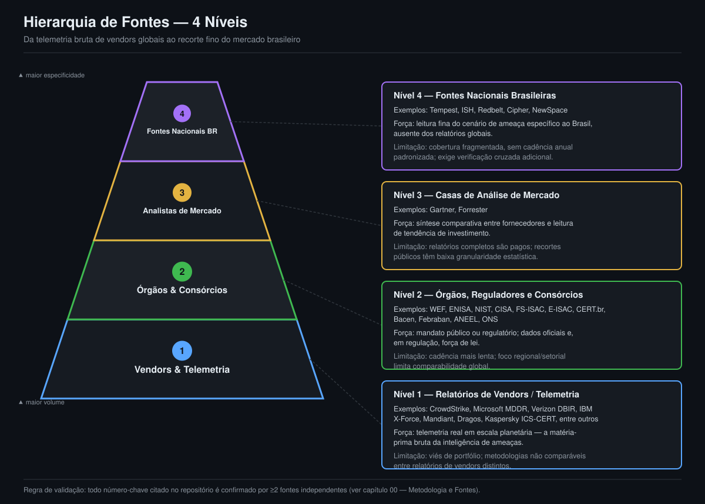

# 00 — Metodologia e Fontes

> **Resumo Executivo**
> - Este panorama distingue inteligência de ameaças **operacional/tática** (telemetria proprietária,
>   IOCs, feeds em tempo real — insumo de SOC) de inteligência **estratégica/de cenário** (relatórios
>   anuais, frameworks, estatística setorial — o que uma apresentação de contexto exige).
> - Os grandes relatórios anuais de vendors (CrowdStrike, Microsoft, Mandiant, Verizon, IBM, Dragos
>   etc.) **já são** a telemetria proprietária dessas empresas, agregada, anonimizada e publicada
>   gratuitamente uma vez por ano — não é preciso pagar por um segundo acesso à mesma matéria-prima
>   para construir uma narrativa de cenário.
> - O valor agregado deste repositório não é coletar dados novos: é **curadoria, recorte Brasil e
>   verificação cruzada** de dados públicos já existentes.
> - Toda hierarquia de fontes segue uma regra fixa de validação: nenhum número-chave é citado com
>   apenas uma fonte quando uma segunda estava disponível, e toda divergência entre fontes é
>   registrada explicitamente, nunca escondida.
> - **Número-chave:** apenas no ano-base 2025, os relatórios setoriais mapeados neste dossiê somam
>   dados de mais de **5.000 firmas financeiras** membras da FS-ISAC em 75 países [1] e de **mais de
>   450 mil horas** de investigações de resposta a incidentes da Mandiant Consulting [2] — volume de
>   telemetria que nenhuma consultoria isolada reproduziria com orçamento de projeto.

## A pergunta que este capítulo responde

Antes de escrever uma única linha deste panorama, a pergunta que qualquer patrocinador de uma
apresentação de cenário de risco cibernético deveria fazer é: *"preciso contratar uma empresa de
threat intelligence paga para montar isto, ou dá para construir com fontes públicas de classe
mundial?"*. A tese deste repositório é que a resposta é **não** — e este capítulo existe para
fundamentar essa resposta com critério, não com propaganda.

## Inteligência operacional × inteligência estratégica

O mercado de *threat intelligence* comercial vende, essencialmente, dois produtos distintos, e a
confusão entre eles é a origem de boa parte da compra desnecessária de contratos caros:

- **Inteligência operacional/tática** — feeds de indicadores de comprometimento (IOCs) em tempo
  real, telemetria proprietária de endpoint/rede, *hunting packages*, playbooks de resposta a
  incidentes, atribuição forense caso a caso. Este é o insumo que um SOC (*Security Operations
  Center*), um time de *threat hunting* ou uma equipe de resposta a incidentes precisa **para agir
  em minutos ou horas** sobre um ambiente específico. Aqui, sim, plataformas comerciais como
  CrowdStrike Falcon Intelligence, Mandiant Advantage, Recorded Future ou Microsoft Defender Threat
  Intelligence entregam algo que nenhuma fonte pública substitui: dados frescos, específicos ao
  cliente e acionáveis em tempo real.
- **Inteligência estratégica/de cenário** — a pergunta "como o risco cibernético evoluiu no setor
  financeiro e no setor de energia nos últimos 12 meses, e o que isso significa para decisões de
  investimento e postura defensiva de médio prazo?". Esta é a pergunta que uma apresentação de
  cenário para o board, para um comitê de riscos ou para uma aula executiva precisa responder — e
  ela é respondida por **relatórios anuais, frameworks normativos e estatística setorial
  consolidada**, não por um feed de IOCs.

O corpo deste repositório — os capítulos 01 a 08 e os números que eles sustentam — é,
deliberadamente, um projeto de inteligência **estratégica**. Não há nos capítulos atribuição
forense própria de nenhum incidente, nem lista de IOCs para bloqueio em firewall. O que há é a
leitura curada do que os maiores provedores de telemetria do mundo **já publicaram sobre seus
próprios dados**.

> **Adendo de 12/08/2026 — a camada operacional do painel.** Desde esta data o painel público
> (score.cecyber.com) passou a exibir uma aba adicional, *Ameaças ao Vivo*, com indicadores
> recentes de fontes abertas recortados para o setor financeiro, servidos por uma instância MISP
> própria. Isso **não revoga** a distinção defendida acima; ao contrário, depende dela. As duas
> camadas convivem separadas e rotuladas:
>
> | | Camada estratégica (caps. 01–08) | Camada operacional (abas ao vivo) |
> | :-- | :-- | :-- |
> | Unidade de análise | estatística setorial consolidada | indicador observado, individual |
> | Regra de evidência | ≥2 fontes independentes por número | fato pontual reportado por uma fonte |
> | Ritmo | anual/semestral, revisado a cada 3 dias | janela móvel de 14 dias, coleta a cada 20 min |
> | Serve para | decidir orçamento e postura | ler atividade recente do setor |
> | **Não** serve para | reagir a uma campanha em curso | ser citado como métrica de setor |
>
> A afirmação original permanece de pé no ponto que importa: **fonte pública aberta não substitui
> threat intelligence paga para operar um SOC**, e a camada operacional aqui não pretende isso. O
> recorte financeiro que ela consegue extrair das fontes abertas é fino e concentrado — na primeira
> coleta, 369 indicadores financeiros em 6.614 coletados (5,6%), dos quais apenas 3 famílias de
> trojan bancário. Esse número é, ele próprio, evidência a favor da tese deste capítulo: quem
> precisa defender um banco em tempo real não se sustenta com o que há de aberto.

> **Adendo de 18/08/2026 — a camada operacional cresceu, e o catálogo dela também.** A camada
> operacional passou de uma aba para três — *Ameaças ao Vivo*, *Brasil* e *Extorsão & Exploração* —
> e ganhou fontes que não existiam no adendo acima: o catálogo **CISA KEV** e o recorte **por país**
> do ransomware.live, que sustenta a aba *Brasil*.
>
> O episódio que produziu esse recorte reforça a tese deste capítulo em vez de arranhá-la. Até 17/08
> a extorsão era consultada só pelo recorte setorial, que é global, e nele o Brasil quase não existe:
> 15 vítimas financeiras brasileiras em todo o arquivo desde 2017, uma nos últimos 90 dias. A leitura
> natural de quem abria o painel aqui era de que faltava fonte — provavelmente paga. Faltava a
> consulta: pelo endpoint de país, a mesma fonte aberta e gratuita tem 530 organizações brasileiras e
> 68 nos últimos 90 dias. A lacuna era de recorte, não de orçamento de inteligência.
>
> O catálogo completo dessas fontes — inclusive as que foram testadas e **recusadas**, com o motivo
> de cada recusa, os feeds abertos habilitados na instância MISP e a governança de publicação — está
> na [Parte 4 de `fontes-e-referencias/README.md`](../fontes-e-referencias/#parte-4--fontes-operacionais-camada-ao-vivo-do-painel)
> e na aba *Fontes & Método* do painel.

## Por que os relatórios anuais dos vendors já são a telemetria

O argumento central é simples e verificável: CrowdStrike, Microsoft, Google Cloud (Mandiant),
Verizon, IBM, Dragos, Kaspersky ICS-CERT e demais vendors listados na hierarquia abaixo não
"opinam" sobre o cenário de ameaças — eles **medem** o próprio tráfego, os próprios *endpoints*
protegidos e os próprios engajamentos de resposta a incidentes, e publicam o resultado agregado uma
vez por ano (às vezes trimestralmente), gratuitamente, como material de marketing institucional e
de posicionamento de marca.

Alguns exemplos concretos, extraídos do dossiê de pesquisa que sustenta este panorama:

- O *FS-ISAC Navigating Cyber 2025* agrega inteligência compartilhada por mais de 5.000 firmas
  financeiras membras em 75 países, com ativos combinados de US$ 100 trilhões [1].
- O *Mandiant M-Trends 2025* consolida mais de 450 mil horas de investigações de resposta a
  incidentes da Mandiant Consulting em métricas de *dwell time* (tempo de permanência do atacante)
  e vetor de acesso inicial [2].
- O *CrowdStrike 2025 Global Threat Report* mede *breakout time* (tempo de propagação lateral) a
  partir da telemetria de todos os *endpoints* protegidos pela plataforma Falcon — a mesma
  telemetria que, em produto pago, alimenta *hunting* em tempo real [3].
- O *Dragos OT/ICS Cybersecurity Year in Review 2026* é construído sobre os próprios engajamentos de
  resposta a incidentes da Dragos em ambientes industriais, com detalhamento de grupos de ameaça,
  ransomware e *dwell time* específico de OT [4].
- O *Verizon 2025 Data Breach Investigations Report* (DBIR) analisa milhares de incidentes
  confirmados reportados por dezenas de organizações parceiras e fornecedores forenses, publicando
  vetores de acesso inicial e padrões de ataque recortados por setor [5].
- O *Microsoft Digital Defense Report 2025* processa mais de 100 trilhões de sinais diários e varre
  cerca de 5 bilhões de e-mails por dia contra malware e phishing — escala de telemetria interna que
  nenhum comprador replicaria isoladamente [6].
- O *ENISA Threat Landscape 2025* consolida incidentes reportados por Estados-membros da União
  Europeia, com detalhamento setorial de infraestrutura crítica e tecnologia operacional [7].
- O *Kaspersky ICS CERT* publica, trimestralmente, o percentual de computadores industriais (ICS)
  nos quais objetos maliciosos foram bloqueados, com recorte por setor (energia elétrica, óleo e gás,
  automação predial) [8].
- O *IBM Cost of a Data Breach Report* mede o custo médio global de uma violação de dados a partir de
  centenas de organizações entrevistadas — US$ 4,44 milhões na edição 2025, revisado para US$ 4,99
  milhões na edição 2026 (publicada em 29/7/2026), o maior valor já registrado [9][11].

Em todos os casos, o dado bruto por trás do relatório é proprietário e não está disponível ao
público — mas a **estatística agregada, curada e contextualizada** está, e é exatamente o nível de
granularidade que uma apresentação de cenário exige. Pagar por acesso direto à telemetria bruta
desses provedores para produzir um panorama executivo seria comprar, com sobrepreço, um insumo mais
granular do que a pergunta de negócio precisa.

## Onde a inteligência paga continua sendo necessária

Ser honesto sobre os limites da tese é parte do método. Existem cenários em que a contratação de
*threat intelligence* comercial **é** justificada, e nenhum panorama construído a partir de fontes
públicas substitui essas funções:

- **Defesa operacional em tempo real** — bloqueio ativo de IOCs, correlação de eventos de SIEM/SOAR
  contra feeds atualizados, priorização de vulnerabilidades específicas ao ambiente do cliente.
- **Caça a ameaças (*threat hunting*)** — investigação proativa e direcionada dentro do próprio
  ambiente, com hipóteses informadas por inteligência de atores específicos.
- **Resposta a incidentes** — atribuição forense de um incidente concreto, com evidência coletada no
  ambiente afetado, algo que nenhum relatório público de terceiros pode fornecer.
- **Antecipação tática de campanhas dirigidas** — quando o perfil de risco da organização (setor,
  geografia, porte) justifica monitoramento contínuo e personalizado de atores específicos.

Nenhuma dessas quatro funções é o objetivo deste repositório. O panorama aqui construído serve para
**decisão estratégica e comunicação executiva** — não para operar um SOC. Isso vale igualmente para
a camada operacional do painel descrita no adendo acima: ela mostra atividade recente do setor a
partir do que é público, o que é uma leitura de contexto — não um fluxo de bloqueio.

## Hierarquia de fontes (4 níveis)

Este repositório organiza suas fontes em quatro níveis, do mais volumoso (telemetria comercial em
escala planetária) ao mais específico (leitura fina do mercado brasileiro). O diagrama abaixo
resume a hierarquia; a tabela na sequência detalha o que cada nível oferece, sua força e sua
limitação.

*Figura 1 — Pirâmide de quatro níveis de fontes: quanto mais próximo da base, maior o volume de
telemetria agregada e a frequência de publicação; quanto mais próximo do topo, maior a
especificidade analítica e o recorte para o mercado brasileiro.*

| Nível | Categoria | Exemplos | O que oferece | Força | Limitação |
|:---:|:-------------------------------|:----------------------------------------------------------------------------------------|:--------------------------------------------------------------|:----------------------------------------------------------------------------|:----------------------------------------------------------------------------------------|
| 1 | Relatórios de vendors / telemetria | CrowdStrike, Microsoft (MDDR), Verizon (DBIR), IBM X-Force + *Cost of a Data Breach*, Mandiant (M-Trends), Unit 42, Fortinet, Check Point, Trellix, Dragos, Kaspersky ICS-CERT, Zscaler, SentinelOne | Estatística agregada de telemetria proprietária (endpoints, incidentes de resposta, tráfego de rede) publicada anualmente ou trimestralmente | Volume e granularidade sem paralelo público; base empírica real, não pesquisa de opinião | Cada vendor enxerga apenas sua própria base de clientes/produtos; viés de portfólio e metodologias não comparáveis entre relatórios |
| 2 | Órgãos, reguladores e consórcios setoriais | WEF, ENISA, NIST, CISA, FS-ISAC, E-ISAC, CERT.br, Banco Central (Bacen), Febraban, ANEEL, ONS | Consolidação multi-membro/multissetorial, mandato público ou regulatório, normas e resoluções vinculantes | Presença institucional de longo prazo; dados oficiais e, no caso regulatório, força de lei | Cadência de publicação mais lenta; foco regional ou setorial limita comparabilidade global direta |
| 3 | Casas de análise de mercado | Gartner, Forrester | Síntese comparativa entre fornecedores, categorização de mercado (quadrantes, ondas), leitura de tendência de investimento | Visão de mercado agregada, útil para *roadmap* tecnológico e decisão de compra | Relatórios completos são pagos; recortes públicos (resumos, comunicados) têm baixa granularidade estatística |
| 4 | Fontes nacionais brasileiras | Tempest, ISH, Redbelt, Cipher, NewSpace | Leitura fina do cenário de ameaça específico ao Brasil, muitas vezes ausente dos relatórios globais | Contexto local que nenhum vendor internacional cobre com a mesma profundidade | Cobertura mais fragmentada, sem cadência anual padronizada; exige verificação cruzada adicional |

## Critérios de validação

A credibilidade deste repositório depende de regras de validação explícitas e auditáveis, aplicadas
de forma consistente em todo o dossiê de pesquisa (`fontes-e-referencias/dossie-pesquisa.md`) e em
todos os capítulos:

1. **Regra de duas fontes independentes.** Todo número-chave citado no corpo do texto busca
   confirmação em ao menos duas fontes que não compartilhem a mesma origem primária — uma fonte
   primária (o relatório original) e, sempre que possível, uma fonte secundária independente
   (cobertura de imprensa especializada, análise de terceiro) que reproduza o mesmo dado. Quando o
   número é confirmado por mais de uma fonte, ambas são citadas em conjunto, no formato `[n][m]`.
2. **Citação rastreável.** Toda estatística no corpo do texto carrega uma citação numérica entre
   colchetes que resolve, sem ambiguidade, para uma entrada na seção final de fontes do mesmo
   arquivo, no formato `[n] Organização. Título. Ano. URL`. Não há "estatística órfã" — nenhum
   número aparece sem uma fonte identificável.
3. **Marcação explícita de dados não confirmados.** Quando uma busca não encontrou uma segunda fonte
   independente, ou quando duas fontes discordam entre si (por exemplo, uma diferença de datas, de
   metodologia de contagem ou de atribuição de um percentual a um subgrupo diferente), isso é
   registrado de forma explícita no dossiê de pesquisa com marcadores como **[NÃO CONFIRMADO]** ou
   **[PARCIALMENTE CONFIRMADO]**, em vez de ser silenciosamente resolvido ou ocultado. Um exemplo
   real deste tratamento está registrado no próprio dossiê: a divergência entre o percentual de
   organizações que consideram geopolítica na estratégia de risco (64% segundo o relatório original
   do WEF, 65% segundo uma cobertura secundária da Fortinet) foi registrada como pequena divergência
   não resolvida, em vez de escolhida arbitrariamente [10].
4. **Preferência por fonte primária.** Sempre que o relatório original (PDF ou página oficial do
   vendor/órgão) pôde ser acessado diretamente, ele é citado como Fonte 1; coberturas de imprensa
   especializada, blogs de análise ou consolidações de terceiros são tratadas como Fonte 2
   (secundária), usadas para corroborar — nunca para substituir — a fonte primária. Quando o acesso
   direto ao PDF primário foi bloqueado ou o documento não pôde ser extraído, isso também é
   registrado, e o dado é tratado com o mesmo rigor: validado por, no mínimo, duas fontes secundárias
   independentes que citam o relatório original de forma consistente.

## Como auditar este repositório

Qualquer leitor pode verificar a cadeia de evidência deste panorama sem depender de confiança cega:

- Toda citação `[n]` no corpo de um capítulo aponta para a seção de fontes do **mesmo arquivo**,
  nunca para uma bibliografia global — a rastreabilidade é local e imediata.
- O dossiê de pesquisa bruto, com a coleta completa de dados, as duas fontes de cada número e as
  observações de divergência, está publicado in extenso em
  [`fontes-e-referencias/dossie-pesquisa.md`](../fontes-e-referencias/dossie-pesquisa.md) — nada do
  que aparece nos capítulos de conteúdo foi "cozinhado" sem deixar rastro do processo de apuração.
  Cada entrada do dossiê traz uma tabela-resumo com o status de confirmação (Confirmado / Parcialmente
  confirmado / Não confirmado) de cada dado.
- Todo URL citado é público e pode ser reaberto pelo leitor para conferência direta contra a fonte
  primária.
- Divergências entre fontes (datas, percentuais, atribuições) são preservadas no texto, não
  arbitradas silenciosamente — quando uma escolha precisou ser feita entre duas leituras
  conflitantes, o critério de desempate (por exemplo, "duas fontes concordantes contra uma
  discordante") é explicado.
- Para a **camada operacional**, que não passa pela regra de duas fontes, a auditoria é outra e está
  igualmente publicada: quais fontes alimentam cada aba, quais foram testadas e recusadas e por quê,
  e que regras de publicação valem para esse material — tudo na
  [Parte 4 de `fontes-e-referencias/README.md`](../fontes-e-referencias/#parte-4--fontes-operacionais-camada-ao-vivo-do-painel).
  O painel repete esse catálogo na aba *Fontes & Método*, para que o leitor não precise vir ao
  repositório para saber de onde veio o que está vendo.

## Fontes

[1] FS-ISAC. *Heightened Cyber Threats are Testing the Operational Resilience of the Financial
Sector (Navigating Cyber 2025)*. Maio de 2025.
https://www.fsisac.com/newsroom/heightened-cyber-threats-are-testing-the-operational-resilience-of-the-financial-sector

[2] Google Cloud (Mandiant). *M-Trends 2025: Data, Insights, and Recommendations From the
Frontlines*. 2025. https://cloud.google.com/security/resources/m-trends

[3] CrowdStrike. *2025 Global Threat Report*. 2025.
https://go.crowdstrike.com/rs/281-OBQ-266/images/CrowdStrikeGlobalThreatReport2025.pdf

[4] Dragos. *Dragos 2026 OT Report Shows Surge in Threat Groups and Ransomware (OT/ICS
Cybersecurity Year in Review 2026)*. Fevereiro de 2026.
https://www.dragos.com/resources/press-release/dragos-2026-year-in-review-new-ot-threats-ransomware

[5] Verizon. *2025 Data Breach Investigations Report*. 2025.
https://www.verizon.com/business/resources/reports/2025-dbir-data-breach-investigations-report.pdf

[6] Microsoft. *Microsoft Digital Defense Report 2025*. 2025.
https://www.microsoft.com/en-us/corporate-responsibility/cybersecurity/microsoft-digital-defense-report-2025/

[7] ENISA. *ENISA Threat Landscape 2025*. Outubro de 2025.
https://www.enisa.europa.eu/publications/enisa-threat-landscape-2025

[8] Kaspersky ICS CERT. *Threat Landscape for Industrial Automation Systems, Q3 2025*. 2025.
https://ics-cert.kaspersky.com/publications/reports/2025/12/11/threat-landscape-for-industrial-automation-systems-q3-2025/

[9] IBM. *Cost of a Data Breach Report 2025*. 2025. https://www.ibm.com/reports/data-breach

[10] World Economic Forum. *Global Cybersecurity Outlook 2026*. Janeiro de 2026.
https://reports.weforum.org/docs/WEF_Global_Cybersecurity_Outlook_2026.pdf

[11] IBM Newsroom. *IBM Study: One in Four Malicious Breaches are AI-Enabled, Costing Companies $6
Million on Average*. 29 de julho de 2026.
https://newsroom.ibm.com/2026-07-29-ibm-study-one-in-four-malicious-breaches-are-ai-enabled,-costing-companies-6-million-on-average
