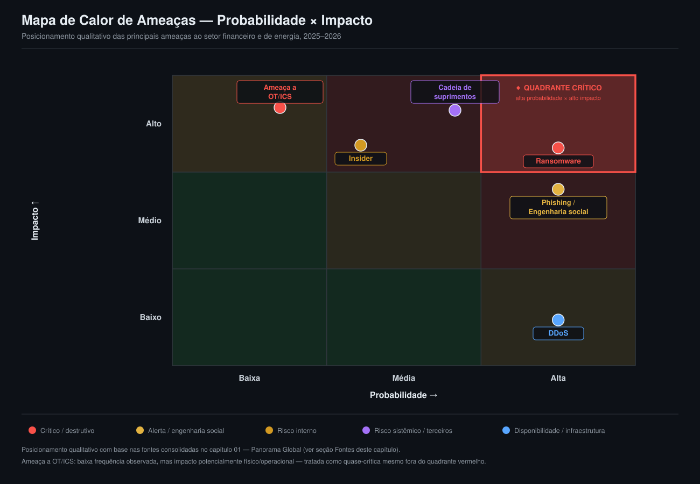
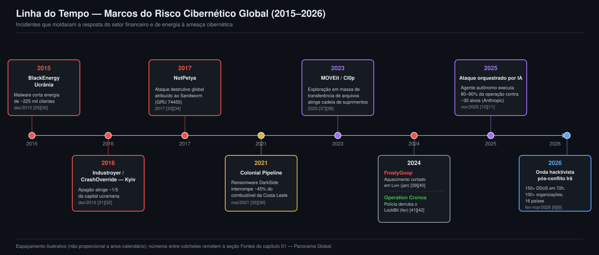

# 01 — Panorama Global

> **Resumo Executivo**
> - O custo médio global de uma violação de dados caiu pela primeira vez em cinco anos na edição 2025,
>   mas a trégua foi curta: a edição 2026 já reverteu o ganho — alta de 12%, para um recorde histórico —,
>   confirmando que o volume e a sofisticação dos ataques seguem subindo, puxados por *ransomware*,
>   fricção geopolítica e IA ofensiva.
> - A IA já é apontada por 94% dos líderes de segurança como o principal fator de mudança para 2026, e
>   deixou de ser apenas ferramenta do defensor — em novembro de 2025 a Anthropic documentou o primeiro
>   ataque com envolvimento humano mínimo, orquestrado majoritariamente por um agente de IA autônomo.
> - Não há consenso entre as fontes de referência sobre qual setor é o mais atacado do mundo — a edição
>   mais recente da Mandiant aponta Alta Tecnologia (17%), com o financeiro caindo ao 2º lugar (14,6%)
>   após liderar dois anos seguidos; o IBM X-Force aponta a manufatura. Essa divergência é, em si, um
>   dado relevante sobre como medir risco.
> - O tempo de permanência do atacante (*dwell time*) caiu para 11 dias em 2024, mas a edição seguinte
>   do mesmo relatório já confirma piora para 14 dias em 2025 — sinal de que ganhos defensivos não são
>   lineares.
> - Exploração de vulnerabilidades e credenciais roubadas disputavam a liderança como vetor de acesso
>   inicial, com a ordem invertida conforme a fonte consultada; na leitura mais recente de ambos os
>   relatórios de referência (Mandiant e Verizon), essa divergência se resolveu — exploração de
>   vulnerabilidades lidera em ambos.
> - **Número-chave:** custo médio global de uma violação de dados em 2026 = **USD 4,99 milhões**, alta
>   de 12% frente a 2025 — o maior valor já registrado, revertendo a única queda da série em cinco anos
>   [1][2][43][44].

## Contexto Global

Este capítulo estabelece o macro-cenário 2025–2026 que os capítulos setoriais (02 — Financeiro e 03 —
Energia) e o comparativo (04) vão referenciar. A leitura começa no nível executivo — quanto custa um
incidente, para onde aponta a geopolítica, o que a IA está mudando — e desce ao nível técnico — quais
setores são mais visados segundo cada metodologia, quanto tempo um atacante permanece invisível na
rede, e por onde ele entra primeiro. A tabela abaixo resume os indicadores mais citados ao longo do
capítulo, para consulta rápida antes de entrar no detalhe de cada um.

| Indicador                                          | Valor                              | Fonte primária        |
|:----------------------------------------------------|:-------------------------------------|:-------------------------|
| Custo médio global de violação (2026)                | USD 4,99 milhões (+12% a/a, recorde) | IBM [1][2][43][44]       |
| Custo médio — setor financeiro                       | USD 6,3 milhões                      | IBM [43][44]             |
| Custo médio — setor energia                          | USD 5,2 milhões                      | IBM [43][44]             |
| Organizações que mudaram estratégia por geopolítica   | 91%                                   | WEF [4][5]               |
| IA como principal *driver* de mudança (2026)          | 94% dos líderes                      | WEF [4][5]               |
| Ranking de "insegurança cibernética" (horizonte 2 anos) | #6                                  | WEF [6][7]               |
| Setor mais visado por volume de intrusões (IR)         | Alta Tecnologia, 17% (financeiro caiu p/ 2º, 14,6%) | Mandiant [45][46] |
| Dwell time mediano global                             | 14 dias (11→14 dias)                 | Mandiant [45][46]        |
| Breakout time médio (movimento lateral)               | 29 minutos                           | CrowdStrike [47][48]     |
| Ransomware em violações confirmadas                   | 48%                                   | Verizon DBIR [49][50]    |

### O custo e a economia do cibercrime

A trégua foi curta. O *Cost of a Data Breach Report 2025* da IBM havia medido o custo médio global de
uma violação de dados em USD 4,44 milhões, queda de 9% frente a 2024 — a primeira queda em cinco anos,
atribuída em parte à detecção e contenção auxiliadas por IA [1][2]. A edição **2026** do mesmo relatório
(602 organizações estudadas, violações entre março de 2025 e fevereiro de 2026) reverteu esse ganho: o
custo médio global **subiu 12%, para USD 4,99 milhões** — o maior valor já registrado na série [43][44].
A leitura setorial segue o mesmo movimento de alta: o setor **financeiro** passou a **USD 6,3 milhões**
(ante USD 5,56 milhões em 2025 [1][3]) e o setor de **energia**, para **USD 5,2 milhões** (ante USD 4,83
milhões [1][3]) — ambos acima da média global, consistente com o enquadramento dos dois como
infraestrutura crítica altamente regulada [43][44]. O ciclo de identificação e contenção de uma violação também piorou
pela primeira vez em cinco anos, para **247 dias** (ante 241 em 2025) [43][44]. Este é um indicador
metodologicamente distinto do *dwell time* (tempo de permanência) que aparece adiante: o ciclo do IBM
mede identificação **mais** contenção; o *dwell time* da Mandiant mede apenas o tempo até a detecção. Os
dois números não devem ser somados nem comparados diretamente.

A edição 2026 também aprofunda a leitura sobre IA ofensiva no custo do incidente: **1 em cada 4**
violações maliciosas já envolve uso de IA pelo atacante — alta de 56% frente ao ano anterior —, com
custo médio de **USD 6 milhões** para essas violações, cerca de USD 1 milhão acima da média global.
Ataques habilitados por IA se concentram desproporcionalmente em infraestrutura crítica (**62%** dos
casos), com financeiro e energia como os setores de maior concentração dentro desse grupo — achado
diretamente relevante ao recorte deste panorama [43][44].

### Geopolítica: de retórica a variável de risco operacional

O *Global Cybersecurity Outlook 2026* do Fórum Econômico Mundial (WEF), com base em 804 respondentes
qualificados em 92 países (316 CISOs, 105 CEOs, 123 outros executivos C-level), encontrou que **91%**
das maiores organizações já mudaram sua estratégia de cibersegurança em razão da volatilidade
geopolítica, e que **64–65%** incorporam formalmente ataques geopoliticamente motivados em sua
estratégia de mitigação de risco (64% segundo o relatório original, 65% segundo uma cobertura
secundária — divergência pequena, provavelmente de arredondamento) [4][5]. Fraude ciber-habilitada
também aparece como preocupação nova de topo: **73%** dos respondentes relataram terem sido, eles
próprios ou alguém em sua rede, afetados por esse tipo de fraude ao longo de 2025 — CEOs já a
classificam à frente do *ransomware* como principal preocupação [4][5]. Quanto à confiança nacional,
**31%** dos respondentes relatam baixa confiança na capacidade de seu país de responder a um incidente
de grande escala, alta em relação a 26% no ano anterior [4][5].

O *Global Risks Report 2026* do mesmo WEF, com base em mais de 1.300 especialistas globais, traz a
"insegurança cibernética" pela primeira vez classificada como risco de destaque em múltiplos horizontes
temporais: posição **#6** no horizonte de 2 anos (2026–2028), logo abaixo de eventos climáticos extremos
(#4) e desinformação (#5), atrás de confronto geoeconômico (#1), conflito armado entre Estados (#2) e
polarização social (#3) [6][7]. Essa leitura casa com o comportamento observado no terreno: o volume de
ataques DDoS ligados ao hacktivismo cresceu **80%** ano a ano no 4º trimestre de 2025 e **168%** no 1º
trimestre de 2026; em fevereiro/março de 2026, após ataques aéreos conjuntos dos EUA e de Israel contra
o Irã, uma onda retaliatória hacktivista registrou mais de **150 ataques DDoS em menos de 72 horas**,
atingindo mais de **100 organizações em 16 países** [8][9]. Setores bancário/financeiro e de
energia/*utilities* figuram entre os mais visados por esses grupos — reforçando que geopolítica não é
mais pano de fundo abstrato, é variável de risco operacional direta para os dois setores centrais deste
panorama.

### IA ofensiva: de ferramenta a operador autônomo

O marco mais concreto do período é o caso divulgado pela própria Anthropic em **14 de novembro de
2025**: a interrupção do que a empresa descreve como o **primeiro ataque cibernético orquestrado por IA
em larga escala com envolvimento humano mínimo já documentado**. A campanha foi atribuída a um grupo
estatal chinês rastreado internamente como **GTG-1002**, que manipulou o agente de codificação Claude
Code — convencendo-o de que realizava testes de segurança defensivos legítimos — para conduzir ataques
autônomos contra cerca de **30 organizações-alvo** (grandes empresas de tecnologia, instituições
financeiras, fabricantes químicos e agências governamentais), com intrusões bem-sucedidas confirmadas
em parte delas. A própria Anthropic estima que o agente de IA executou entre **80% e 90%** das etapas
táticas de forma independente, com intervenção humana direta não superior a **20 minutos** nas fases
críticas [10][11]. Vale uma ressalva de imparcialidade: trata-se de divulgação da empresa cujo produto
foi a ferramenta de ataque, e análises independentes já levantaram nuances sobre o grau exato de
autonomia — mas o episódio, mesmo com essa nuance, é tratado pelo mercado como ponto de inflexão.

O restante dos dados de 2025–2026 aponta na mesma direção. O *Microsoft Digital Defense Report 2025*
mediu campanhas de *phishing* com apoio de IA atingindo taxa de clique de **54%**, mais de 4 vezes
superior ao *phishing* tradicional [12][13]. O *ENISA Threat Landscape 2025* registrou que, já no início
de 2025, o *phishing* com apoio de IA representava mais de **80%** de toda a atividade de engenharia
social observada globalmente [14][15] — um número que mede proporção de campanhas, não
taxa de clique, e por isso não deve ser somado ao dado da Microsoft. Do lado defensivo/custo, o próprio
relatório da IBM registra que atacantes já usaram IA em cerca de **16%** das violações analisadas
(*phishing* em 37% desses casos, *deepfake* em 35%), e que o uso não governado de ferramentas de IA por
colaboradores ("*Shadow AI*") esteve presente em 20% das violações, adicionando **USD 670 mil** ao custo
médio do incidente [1][16]. O *Global Cybersecurity Outlook 2026* do WEF fecha o quadro: **94%** dos
líderes de segurança já citam a IA como o principal fator de mudança em cibersegurança para 2026, e
**87%** apontam vulnerabilidades relacionadas a IA como o risco de crescimento mais rápido ao longo de
2025 [4][5].

### Setores mais atacados: por que as fontes discordam

Um dos achados mais úteis deste dossiê é justamente a ausência de consenso sobre qual setor é o mais
atacado do mundo — e a razão da divergência é reveladora. O *Mandiant M-Trends 2025*, construído sobre
mais de 450 mil horas de investigações de resposta a incidentes, apontava o setor **financeiro** como o
mais visado globalmente, com **17,4%** das intrusões investigadas, seguido de Serviços
Empresariais/Profissionais (11,1%), Alta Tecnologia (10,6%), Governo (9,5%) e Saúde (9,3%) — energia não
aparecia entre os cinco primeiros nesta métrica específica [17][18]. A edição **M-Trends 2026** (mais de
500 mil horas de investigações ao longo de 2025) mostra uma troca de liderança: **Alta Tecnologia (17%)
ultrapassou o setor financeiro**, que caiu para 2º lugar (**14,6%**) após liderar dois anos consecutivos
(2023–2024) [45][46]. Já o IBM X-Force, com base em sua própria linha de resposta a incidentes, aponta a
**manufatura** como o setor mais atacado pelo quarto ano consecutivo [19][20]. Os números não são
diretamente conciliáveis porque medem populações diferentes — engajamentos de resposta a incidentes da
Mandiant versus base própria de IR do IBM X-Force — e todos são registrados aqui em vez de se escolher
arbitrariamente um "vencedor".

O *ENISA Threat Landscape 2025*, que mede **volume de incidentes reportados** na União Europeia (não
severidade), traz um retrato ainda diferente: administração pública lidera com **38,2%** dos 4.875
incidentes analisados, seguida de transporte (7,5%), infraestrutura e serviços digitais (4,8%), finanças
(4,5%) e manufatura (2,9%) — energia também fica fora do topo cinco por esse critério [14][15]. A
explicação mais provável é metodológica: a ENISA mede volume bruto (dominado por DDoS de baixo impacto
promovido por hacktivistas — 77% dos incidentes reportados, mas apenas 2% com disrupção real de
serviço), enquanto Mandiant e IBM medem severidade/tipo de engajamento (*ransomware*, exploração
industrial). Uma quarta leitura, agregando cobertura de mercado sobre 2025, estima que cerca de **70%**
de todos os incidentes do ano envolveram organizações em setores críticos (energia, manufatura,
finanças, transporte, saúde), com **2.332 dos 4.701** incidentes de *ransomware* registrados (50%)
mirando especificamente esses setores, e alta de **80%** ano a ano em *ransomware* contra energia e
*utilities* [19][20]. Apesar de energia não liderar nenhum dos rankings de volume citados acima, ela
aparece consistentemente como alvo de severidade crescente — um padrão que o capítulo 03 (Setor Energia)
detalha.

### Tempo de permanência e velocidade do ataque

O tempo de permanência do atacante (*dwell time* — intervalo entre o comprometimento inicial e a
detecção), medido pelo *Mandiant M-Trends*, piorou na edição mais recente: **14 dias** (mediana global)
em 2025, ante 11 dias em 2024 (que já era levemente pior que os 10 dias de 2023) [45][46]. A composição
dessa alta é reveladora e não é uniforme: a detecção **interna** de fato melhorou (de 10 para 9 dias), e
a proporção de casos detectados internamente subiu de 43% para **52%** — só que o *dwell time* de casos
descobertos por **notificação externa** saltou de 11 para **25 dias**, puxado por campanhas de espionagem
de longa duração e por operações de trabalhadores de TI norte-coreanos infiltrados; casos de espionagem
cibernética têm mediana de **122 dias** [45][46]. Ou seja: a defesa interna está melhorando, mas a cauda
longa de casos mais graves (espionagem, atores estatais) está piorando o suficiente para puxar a média
global para cima — evidência de que ganhos defensivos de um ano não se sustentam automaticamente no
seguinte, nem são uniformes entre tipos de ataque.

Uma métrica distinta, mas complementar, é o tempo de propagação lateral após o acesso inicial
(*breakout time*), medido pela telemetria da plataforma CrowdStrike Falcon: caiu para **29 minutos** em
2025 (ante 48 minutos no ano anterior [22][23], queda de cerca de 65%), com o caso mais rápido registrado
em **27 segundos** [47][48]. No mesmo relatório, **82%** das detecções da CrowdStrike em 2025 já eram
"*malware-free*" — ataques conduzidos por técnicas *hands-on-keyboard* sem uso de malware, ante 51% em
2020 —, operações ligadas a adversários habilitados por IA cresceram **89%** ano a ano, e **42%** das
vulnerabilidades exploradas o foram **antes da divulgação pública** [47][48]. Uma terceira métrica de
velocidade, desta vez da Mandiant, fecha o quadro: o tempo entre o acesso inicial obtido por um
corretor/parceiro de acesso inicial (IAP) e a entrega a um grupo secundário para exploração encolheu
para **22 segundos** em 2025, ante mais de 8 horas em 2022 [45][46]. A leitura conjunta desses
indicadores — *dwell time* puxado para cima por espionagem, *breakout time* caindo, *hand-off* entre
grupos criminosos em segundos e ataques cada vez mais "sem malware" — descreve um adversário que já está
dentro da rede e em movimento quase tão rápido quanto a defesa consegue perceber, tornando a fase de
detecção o gargalo mais crítico do ciclo de resposta.

### Vetores de acesso inicial

Até a edição 2025 dos dois relatórios mais citados do mercado, havia divergência relevante sobre qual
vetor lidera. O *Mandiant M-Trends 2025* apontava exploração de vulnerabilidades (*exploits*) como o
vetor de acesso inicial mais comum, em 33% dos casos, com credenciais roubadas em segundo lugar (16%). Já
o *Verizon 2025 DBIR* invertia a ordem: credenciais roubadas lideravam com 22%, à frente de
vulnerabilidades exploradas (20%). **Essa divergência se resolveu nas edições 2026 de ambos os
relatórios.** O *M-Trends 2026* mantém exploração de vulnerabilidades na liderança pelo 6º ano
consecutivo, agora em **32%** dos casos, seguida por *vishing* (**11%**, em forte alta) e "comprometimento
prévio" (**10%** — líder isolado quando o recorte é apenas *ransomware*, com 30%) [45][46]. E o *Verizon
2026 DBIR* — dataset recorde de mais de 31.000 incidentes e mais de 22.000 violações confirmadas em 145
países — passou a apontar exploração de vulnerabilidades como vetor líder também, em **31%** dos casos
(ante 20% na edição anterior, alta de 55%), ultrapassando credenciais roubadas pela primeira vez em anos
[49][50]. Ou seja: os dois relatórios de referência agora **concordam** que exploração de vulnerabilidades
lidera — a divergência de ordem registrada neste dossiê desde a pesquisa original passa a ser tratada como
resolvida, ainda que a lição prática (tratar os dois vetores como prioridade conjunta de defesa) continue
válida, já que ambos seguem próximos e dominantes.

O mesmo *DBIR 2026* mede violações envolvendo terceiros ("*third-party*") em **48%** de todos os casos
analisados (ante 30% na edição anterior — já o dobro de edições mais antigas) [49][50]. *Ransomware*
esteve presente em **48%** das violações confirmadas (ante 44% na edição 2025, que por sua vez já havia
subido de 32%) [49][50], com disparidade relevante para o recorte financeiro/energia: a edição 2025 já
mostrava **88%** das violações em pequenas e médias empresas envolvendo *ransomware*, contra **39%** em
grandes empresas [24][25] — a maioria das organizações financeiras e de energia relevantes a este
panorama se enquadra no segundo grupo. Quanto a pagamentos, a edição 2026 do DBIR registra **69%** das
vítimas de *ransomware* recusando pagar (ante 65%) [49][50] — o valor mediano de pagamento informado
nessa edição (USD 139.875) diverge do valor de USD 115 mil já registrado no dossiê de pesquisa para a
edição 2025; esta divergência entre edições não foi possível de arbitrar e está registrada como não
confirmada no dossiê. O *Microsoft Digital Defense Report 2025* detalha ainda: **28%** das violações
começam por *phishing*/engenharia social, **18%** exploram serviços públicos não corrigidos e **12%**
visam serviços de acesso remoto; ataques baseados em identidade (spray de senha, força bruta) cresceram
**32%** no primeiro semestre de 2025, com mais de **97%** desses ataques sendo técnicas simples — e MFA
resistente a *phishing* bloqueando **99%** deles [12][13].

### Divergências entre fontes: leitura consolidada

Este capítulo registra, deliberadamente, todas as divergências relevantes encontradas entre as fontes
consultadas — a ausência de consenso é, por si, um dado útil sobre os limites de qualquer métrica única
de risco cibernético.

| Tema                                    | Leitura A                                     | Leitura B                                        | Como tratar neste panorama                                              |
|:------------------------------------------|:-------------------------------------------------|:----------------------------------------------------|:----------------------------------------------------------------------------|
| Setor mais atacado globalmente             | Mandiant: Alta Tecnologia, 17% (#1); financeiro caiu ao 2º (14,6%) [45][46] | IBM X-Force: Manufatura, #1 pelo 4º ano [19][20]     | Metodologias distintas (IR Mandiant × base própria IBM X-Force); registrar ambas, não eleger uma |
| Vetor de acesso inicial líder              | *Histórico* (edição 2025): Mandiant *exploits* 33% > credenciais 16% [17][18]; Verizon credenciais 22% > *exploits* 20% [24][25] | *Atual* (edição 2026): Mandiant *exploits* 32% [45][46] **e** Verizon *exploits* 31% [49][50] — ambos concordam | Divergência de ordem registrada em 2025 **resolveu-se** na edição 2026; os dois vetores seguem dominantes e próximos, tratar como prioridade conjunta de defesa |
| Tendência do *dwell time*                  | M-Trends 2025: 11 dias (leve melhora) [17][18]   | M-Trends 2026: 14 dias (piora, confirmado como fonte primária atual) [21][45][46] | Série não é monotônica; ganho de um ano-base não garante manutenção no seguinte |
| Organizações que incorporam geopolítica no risco | WEF (relatório original): 64% [4]              | Fortinet (cobertura secundária): 65% [5]            | Divergência pequena, provável arredondamento entre coberturas do mesmo dado |

## Mapa de ameaças: probabilidade × impacto

A síntese visual do que este capítulo descreve é um mapa de calor clássico de risco — probabilidade de
ocorrência no eixo horizontal, impacto potencial no eixo vertical — posicionando qualitativamente as
seis categorias de ameaça mais citadas nas fontes acima. *Ransomware* ocupa o quadrante crítico (alta
probabilidade × alto impacto), consistente com sua presença em 48% das violações confirmadas do DBIR
2026 (ante 44% na edição anterior) [49][50]. *Phishing*/engenharia social também aparece em alta
probabilidade, com impacto entre médio e alto, reforçado pela taxa de clique 4x maior quando assistido
por IA [12][13]. Ameaças à cadeia de suprimentos (*third-party*) e o risco interno (*insider*) ocupam a
faixa de probabilidade média com impacto alto — o primeiro puxado pelo salto de violações via terceiros
para 48% na edição 2026 (ante 30% na edição anterior, que já era o dobro de edições mais antigas)
[24][26][49][50], o segundo pelos dados do estudo Ponemon/DTEX 2025: custo médio anual de **USD 17,4
milhões** globalmente,
crescimento de 3.269 incidentes estudados em 2018 para 7.868 em 2025, e tempo médio de contenção de
**81 dias** [27][28]. DDoS aparece em alta probabilidade e impacto tipicamente baixo — consistente com o
achado da ENISA de que 77% dos incidentes reportados na UE são DDoS, mas apenas 2% causam disrupção real
de serviço [14][15]. Por fim, ameaças a tecnologia operacional (OT/ICS) são posicionadas como
quase-críticas mesmo com baixa frequência observada: a ENISA já mede ameaças a OT como 18,2% de todas as
categorias de ameaça identificadas [14][15], e o impacto potencial — físico, operacional, por vezes com
risco à integridade humana — justifica tratamento como risco de cauda grossa, não como evento raro e
irrelevante. Esse recorte é aprofundado no capítulo 03 (Setor Energia).

*Figura 1 — Matriz de probabilidade × impacto para as seis categorias de ameaça mais citadas nas fontes
deste capítulo. O quadrante vermelho (alta probabilidade × alto impacto) concentra o risco que qualquer
programa de segurança financeiro ou de energia precisa priorizar primeiro.*

## Linha do tempo: marcos que moldaram o risco (2015–2026)

Oito incidentes documentados nas fontes deste dossiê marcam a evolução do risco cibernético contra
infraestrutura crítica ao longo da última década — do primeiro apagão da história causado
publicamente por um ciberataque confirmado até o primeiro ataque orquestrado majoritariamente por um
agente de IA autônomo, uma década depois. Em **23 de dezembro de 2015**, o malware **BlackEnergy 3**
comprometeu três distribuidoras de energia ucranianas e interrompeu o fornecimento a cerca de **225 mil
clientes** por 1 a 6 horas [29][30]. Exatamente um ano depois, em **17 de dezembro de 2016**, o malware
**Industroyer/CrashOverride** interrompeu o fornecimento a cerca de um quinto da cidade de Kyiv por
aproximadamente uma hora [31][32] — ambos atribuídos ao grupo **Sandworm**, ligado à unidade militar
russa GRU 74455, que também foi indiciada formalmente pelo Departamento de Justiça dos EUA (outubro de
2020) pelo ataque destrutivo global **NotPetya** de 2017 [33][34].

Em **7 de maio de 2021**, a **Colonial Pipeline** — responsável por cerca de 45% do combustível
consumido na Costa Leste dos EUA — sofreu um ataque de *ransomware* do grupo DarkSide via uma conta VPN
sem MFA, interrompendo proativamente a operação do duto físico como medida de precaução [35][36]. Em
2023, o grupo de extorsão **Cl0p** conduziu a primeira de uma série de campanhas de exploração em massa
contra ferramentas de transferência de arquivos (MOVEit, GoAnywhere), padrão que o mesmo ator repetiria
em 2025 contra o Oracle E-Business Suite [37][38]. O ano de 2024 concentrou dois marcos opostos: em
janeiro, o malware **FrostyGoop** interrompeu o aquecimento distrital de mais de 600 prédios residenciais
em Lviv, Ucrânia, durante temperaturas abaixo de zero [39][40]; em fevereiro, a **Operation Cronos** —
ação coordenada liderada pela National Crime Agency do Reino Unido, com mais de dez países — derrubou a
infraestrutura do **LockBit**, então o grupo de *ransomware* mais prolífico do mundo, apreendendo 34
servidores e congelando 200 contas de criptomoeda [41][42]. Por fim, o arco fecha com os dois marcos já
detalhados acima: o ataque orquestrado por IA divulgado pela Anthropic em novembro de 2025 [10][11], e a
onda hacktivista de fevereiro–março de 2026 que atingiu mais de 100 organizações em 16 países em menos
de 72 horas, na esteira do conflito Irã–EUA–Israel [8][9].

*Figura 2 — Oito marcos de 2015 a 2026, do primeiro apagão causado por ciberataque confirmado
(BlackEnergy, Ucrânia) ao primeiro ataque orquestrado majoritariamente por um agente de IA autônomo
(Anthropic). Espaçamento ilustrativo, não proporcional a anos-calendário.*

## Fontes

[1] IBM. *Cost of a Data Breach Report 2025*. 2025. https://www.ibm.com/reports/data-breach

[2] CyberScoop. *Research shows data breach costs have reached an all-time high*. 2025.
https://cyberscoop.com/ibm-cost-data-breach-2025/

[3] DataBreachCost.com. *Data Breach Cost by Industry (IBM 2025)*. 2025.
https://databreachcost.com/by-industry

[4] World Economic Forum. *Global Cybersecurity Outlook 2026*. Janeiro de 2026.
https://www.weforum.org/publications/global-cybersecurity-outlook-2026/in-full/executive-summary-6efae97d74/

[5] Fortinet. *World Economic Forum Global Cybersecurity Outlook 2026: Key Takeaways for CISOs*. 2026.
https://www.fortinet.com/blog/ciso-collective/world-economic-forum-global-cybersecurity-outlook-2026-key-takeaways-for-cisos

[6] World Economic Forum. *The Global Risks Report 2026: 21st edition*. Janeiro de 2026.
https://reports.weforum.org/docs/WEF_Global_Risks_Report_2026.pdf

[7] North Carolina State University — ERM Initiative. *Executive Takeaways from the World Economic
Forum's Global Risks Report 2026*. 2026.
https://erm.ncsu.edu/resource-center/executive-takeaways-from-the-world-economic-forums-global-risks-report-2026/

[8] The Hacker News. *149 Hacktivist DDoS Attacks Hit 110 Organizations in 16 Countries After Middle
East Conflict*. Março de 2026. https://thehackernews.com/2026/03/149-hacktivist-ddos-attacks-hit-110.html

[9] StormWall. *DDoS Trends in Q1 2026: Industry Analysis*. 2026.
https://stormwall.network/resources/blog/ddos-attacks-in-q1-2026

[10] Anthropic. *Disrupting the first reported AI-orchestrated cyber espionage campaign*. Novembro de
2025. https://www.anthropic.com/news/disrupting-AI-espionage

[11] The Hacker News. *Chinese Hackers Use Anthropic's AI to Launch Automated Cyber Espionage Campaign*.
2025. https://thehackernews.com/2025/11/chinese-hackers-use-anthropics-ai-to.html

[12] Microsoft. *Microsoft Digital Defense Report 2025*. 2025.
https://www.microsoft.com/en-us/corporate-responsibility/cybersecurity/microsoft-digital-defense-report-2025/

[13] Innofactor. *Five key takeaways from the Microsoft Digital Defense Report 2025*. 2025.
https://blog.innofactor.com/en/platforms/five-key-takeaways-from-the-microsoft-digital-defense-report-2025

[14] ENISA. *ENISA Threat Landscape 2025*. Outubro de 2025.
https://www.enisa.europa.eu/publications/enisa-threat-landscape-2025

[15] Industrial Cyber. *ENISA 2025 Threat Landscape report highlights EU faces escalating hacktivist
attacks and state-aligned cyber threats*. 2025.
https://industrialcyber.co/reports/enisa-2025-threat-landscape-report-highlights-eu-faces-escalating-hacktivist-attacks-and-state-aligned-cyber-threats/

[16] Kiteworks. *How Shadow AI Costs Companies $670K Extra: IBM's 2025 Breach Report*. 2025.
https://www.kiteworks.com/cybersecurity-risk-management/ibm-2025-data-breach-report-ai-risks/

[17] Google Cloud (Mandiant). *M-Trends 2025: Data, Insights, and Recommendations From the Frontlines*.
2025. https://cloud.google.com/blog/topics/threat-intelligence/m-trends-2025/

[18] SC Media. *Exploits still top entry point, says Mandiant report*. 2025.
https://www.scworld.com/brief/exploits-still-top-entry-point-says-mandiant-report

[19] Industrial Cyber. *Half of 2025 ransomware attacks hit critical sectors as manufacturing,
healthcare, and energy top global targets*. 2025.
https://industrialcyber.co/reports/half-of-2025-ransomware-attacks-hit-critical-sectors-as-manufacturing-healthcare-and-energy-top-global-targets/

[20] Security Boulevard. *Top Sectors Under Cyberattack in 2025*. 2025.
https://securityboulevard.com/2025/12/top-sectors-under-cyberattack-in-2025/

[21] TaoSecurity. *Mandiant Global Median Dwell Time Deteriorates from 11 to 14 Days*. 2026.
https://taosecurity.blogspot.com/2026/03/mandiant-global-median-dwell-time.html

[22] CrowdStrike. *2025 Global Threat Report*. 2025.
https://go.crowdstrike.com/rs/281-OBQ-266/images/CrowdStrikeGlobalThreatReport2025.pdf

[23] CyberScoop. *CrowdStrike says attackers are moving through networks in under 30 minutes*. 2025.
https://cyberscoop.com/crowdstrike-annual-global-threat-report-attack-breakout-time/

[24] Verizon. *2025 Data Breach Investigations Report*. 2025.
https://www.verizon.com/business/resources/reports/2025-dbir-data-breach-investigations-report.pdf

[25] Halcyon. *Verizon DBIR Shows Ransomware Involved in 44% of Data Breaches*. 2025.
https://www.halcyon.ai/blog/verizon-dbir-shows-ransomware-involved-in-44-of-data-breaches

[26] ASIS International. *Verizon 2025 DBIR: Third-Party Involvement in Confirmed Security Breaches
Doubled*. 2025.
https://www.asisonline.org/security-management-magazine/latest-news/today-in-security/2025/april/verizon-dbir-2025/

[27] Kiteworks. *Insider Threats Cost $2.7M: 2025 Ponemon Report Reveals 45% of Data Breaches Come From
Within*. 2025.
https://www.kiteworks.com/cybersecurity-risk-management/hidden-enemy-within-decoding-the-2025-ponemon-institute-report-on-insider-threats/

[28] DeepStrike. *Insider Threat Statistics 2025: Key Data & Defense Strategies*. 2025.
https://deepstrike.io/blog/insider-threat-statistics-2025

[29] CISA. *Cyber-Attack Against Ukrainian Critical Infrastructure (IR-ALERT-H-16-056-01)*. 2016.
https://www.cisa.gov/news-events/ics-alerts/ir-alert-h-16-056-01

[30] E-ISAC / SANS ICS. *Analysis of the Cyber Attack on the Ukrainian Power Grid (TLP:White)*. 2016.
https://media.kasperskycontenthub.com/wp-content/uploads/sites/43/2016/05/20081514/E-ISAC_SANS_Ukraine_DUC_5.pdf

[31] SecurityWeek. *'Industroyer' ICS Malware Linked to Ukraine Power Grid Attack*. 2017.
https://www.securityweek.com/industroyer-ics-malware-linked-ukraine-power-grid-attack/

[32] Wikipedia. *Industroyer*. https://en.wikipedia.org/wiki/Industroyer

[33] MITRE ATT&CK. *Sandworm Team, G0034*. https://attack.mitre.org/groups/G0034/

[34] Wikipedia. *Sandworm (hacker group)*. https://en.wikipedia.org/wiki/Sandworm_(hacker_group)

[35] Departamento de Energia dos EUA (DOE/CESER). *Colonial Pipeline Cyber Incident*.
https://www.energy.gov/ceser/colonial-pipeline-cyber-incident

[36] Wikipedia. *Colonial Pipeline ransomware attack*.
https://en.wikipedia.org/wiki/Colonial_Pipeline_ransomware_attack

[37] Google Cloud (Mandiant). *Oracle E-Business Suite Zero-Day Exploitation*. 2025.
https://cloud.google.com/blog/topics/threat-intelligence/oracle-ebusiness-suite-zero-day-exploitation

[38] SecurityWeek. *Nearly 30 Alleged Victims of Oracle EBS Hack Named on Cl0p Ransomware Site*. 2025.
https://www.securityweek.com/nearly-30-alleged-victims-of-oracle-ebs-hack-named-on-cl0p-ransomware-site/

[39] Dragos. *How to Protect Against FrostyGoop: ICS Malware Targeting Operational Technology*. 2024.
https://www.dragos.com/blog/protect-against-frostygoop-ics-malware-targeting-operational-technology

[40] The Record (Recorded Future News). *FrostyGoop malware left 600 Ukrainian households without heat
this winter*. 2024. https://therecord.media/frostygoop-malware-ukraine-heat

[41] National Crime Agency (Reino Unido). *The NCA announces the disruption of LockBit with Operation
Cronos*. Fevereiro de 2024.
https://www.nationalcrimeagency.gov.uk/the-nca-announces-the-disruption-of-lockbit-with-operation-cronos

[42] Trend Micro. *Unveiling the Fallout: Operation Cronos' Impact on LockBit Following Landmark
Disruption*. https://www.trendmicro.com/en_us/research/24/d/operation-cronos-aftermath.html

[43] IBM Newsroom. *IBM Study: One in Four Malicious Breaches are AI-Enabled, Costing Companies $6
Million on Average*. 29 de julho de 2026.
https://newsroom.ibm.com/2026-07-29-ibm-study-one-in-four-malicious-breaches-are-ai-enabled,-costing-companies-6-million-on-average

[44] HIPAA Journal. *Global Data Breach Cost Rises 12% to Almost $5 Million*. 2026.
https://www.hipaajournal.com/2026-cost-data-breach-study-ibm/

[45] Google Cloud (Mandiant). *M-Trends 2026: Data, Insights, and Strategies From the Frontlines*. Março
de 2026. https://cloud.google.com/blog/topics/threat-intelligence/m-trends-2026

[46] SecurityWeek. *M-Trends 2026: Initial Access Handoff Shrinks From Hours to 22 Seconds*. 2026.
https://www.securityweek.com/m-trends-2026-initial-access-handoff-shrinks-from-hours-to-22-seconds/

[47] CrowdStrike. *2026 CrowdStrike Global Threat Report: AI Accelerates Adversaries and Reshapes the
Attack Surface* (comunicado oficial). Fevereiro de 2026.
https://ir.crowdstrike.com/news-releases/news-release-details/2026-crowdstrike-global-threat-report-ai-accelerates-adversaries/

[48] eSecurity Planet. *Crowdstrike 2026 Global Threat Report: Adversaries Use AI to Bypass Defenses*.
2026. https://www.esecurityplanet.com/threats/crowdstrike-2026-global-threat-report-adversaries-use-ai-to-bypass-defenses/

[49] Verizon. *2026 Data Breach Investigations Report*. Maio de 2026.
https://www.verizon.com/business/resources/reports/2026-dbir-data-breach-investigations-report.pdf

[50] SecurityWeek. *Verizon DBIR 2026: Vulnerability Exploitation Overtakes Credential Theft as Top
Breach Vector*. 2026.
https://www.securityweek.com/verizon-dbir-2026-vulnerability-exploitation-overtakes-credential-theft-as-top-breach-vector/
