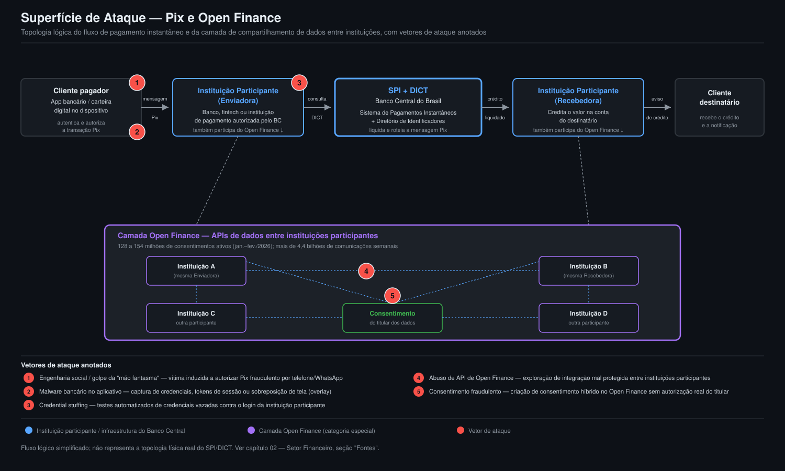
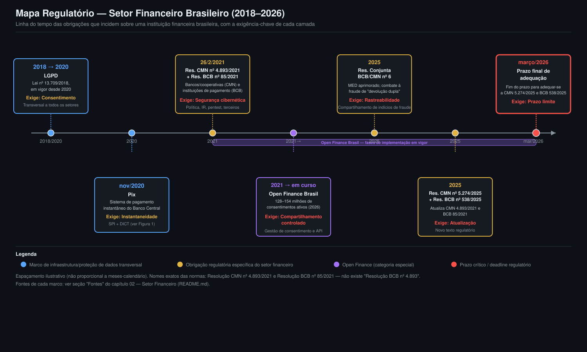

# 02 — Setor Financeiro

          

> **Resumo Executivo**
> - O setor financeiro segue entre os mais visados do mundo: 2º lugar no ranking da FS-ISAC (atrás
>   apenas de saúde), com quatro ameaças dominantes — fraude potencializada por IA generativa (incluindo
>   *deepfake* de executivos), risco de terceiros/cadeia de suprimentos, DDoS/*ransomware* em
>   sofisticação crescente e exploração de tensões geopolíticas.
> - *Ransomware* direto contra instituições financeiras voltou a acelerar: de 156 incidentes em 2024
>   para 202 em 2025 (+30%), com o 1º trimestre de 2026 já 76% acima do mesmo período do ano anterior.
> - Fraude por *deepfake* deixou de ser hipótese: cresceu 2.137% em três anos e já responde por 6,5% de
>   todas as tentativas de fraude, com casos concretos de dezenas de milhões de dólares desviados por
>   clonagem de voz de executivos.
> - No Brasil, o Pix concentra o epicentro do risco de fraude ao consumidor, enquanto o Open Finance
>   — com mais de 128 milhões de consentimentos ativos — abre uma superfície de ataque nova via API;
>   a resposta regulatória do Banco Central (Resolução CMN nº 4.893/2021 e Resolução BCB nº 85/2021,
>   atualizadas em 2025) é uma das mais maduras do mundo em cibersegurança financeira.
> - Uma sequência de incidentes de terceiros em 2024–2025 (C&M Software, FictorPay) mostrou que a
>   vulnerabilidade sistêmica do Pix está menos nos bancos centrais do sistema e mais nos provedores de
>   infraestrutura e software compartilhados por múltiplas instituições.
> - **Número-chave:** custo médio de uma violação de dados no setor financeiro em 2025 = **USD 5,56
>   milhões** — 2º setor mais caro do mundo, 25% acima da média global (USD 4,44 milhões) [1][2].

## Contexto Global

Este capítulo aprofunda, para o setor financeiro, o macro-cenário já estabelecido no capítulo 01
(Panorama Global). A leitura segue do executivo ao técnico: primeiro o quadro de ameaças e o custo
econômico do incidente, depois o detalhamento por relatório de referência (FS-ISAC, IBM, Verizon,
CrowdStrike, Black Kite), os atores mais relevantes e, na segunda metade do capítulo, o recorte
brasileiro — Pix, Open Finance, regulação do Banco Central e incidentes conhecidos.

| Indicador                                              | Valor                                  | Fonte primária              |
|:---------------------------------------------------------|:------------------------------------------|:--------------------------------|
| Ranking de setor mais atacado (FS-ISAC)                   | 2º lugar, atrás de saúde                 | FS-ISAC [1][2]                  |
| Custo médio de violação — setor financeiro                 | USD 5,56 milhões (-9% a/a)               | IBM [3][4]                      |
| Detecção/escalonamento no custo total (setor financeiro)    | 34% (vs. 29% global)                     | IBM [3][4]                      |
| Incidentes / violações confirmadas (Finance Snapshot)        | 3.336 / 927                              | Verizon DBIR [5]                |
| Motivação financeira / espionagem (setor)                    | 90% / 12%                                | Verizon DBIR [5]                |
| DDoS no setor financeiro (2022→2023)                        | +154%; 35%+ de todo DDoS observado       | FS-ISAC/Akamai [6][7]           |
| Roubo de ativos digitais (DPRK-nexus, 2025)                  | USD 2,02 bilhões (+51% a/a)              | CrowdStrike [8][9]              |
| Maior roubo cripto único (PRESSURE CHOLLIMA)                 | USD 1,46 bilhão                          | CrowdStrike [8][9]              |
| *Ransomware* direto no setor financeiro (2024→2025)           | 156 → 202 incidentes (+~30%)             | Black Kite [10][11]             |
| *Ransomware* setor financeiro, Q1 2026 vs. Q1 2025            | +76% (65 incidentes)                     | Black Kite [10][11]             |
| Fraude por *deepfake* (evolução em 3 anos)                    | 0,1% → 6,5% das tentativas (+2.137%)    | Cyble/StationX/BrightDefense [12][14] |

### FS-ISAC: as quatro ameaças que definem o setor

O relatório *Navigating Cyber 2025* da FS-ISAC — associação setorial que reúne mais de 5.000 firmas
financeiras membras em 75 países, com ativos combinados de USD 100 trilhões — confirma que **serviços
financeiros é o 2º setor mais atacado globalmente, atrás apenas de saúde** [1][2]. Quatro categorias de
ameaça concentram o risco: (1) fraude e golpes potencializados por IA generativa, incluindo *deepfakes*
visando executivos; (2) ataques à cadeia de suprimentos e a fornecedores terceiros; (3) DDoS e
*ransomware* em sofisticação crescente; e (4) exploração de tensões geopolíticas e incerteza econômica
[1][2]. O comunicado da própria FS-ISAC não traz percentuais numéricos detalhados por categoria — apenas
a classificação qualitativa e o ranking setorial —, algo já registrado como limitação no dossiê de
pesquisa deste projeto.

### Custo de violação: por que o setor financeiro paga mais para responder

O *Cost of a Data Breach Report 2025* da IBM mediu custo médio de **USD 5,56 milhões** para o setor
financeiro — 2º colocado entre 17 setores, atrás de saúde, e 25% acima da média global de USD 4,44
milhões, ainda que 9% abaixo dos USD 6,08 milhões de 2024 [3][4]. A composição de custo do setor difere
do padrão global de um jeito revelador: detecção e escalonamento correspondem a **34%** do custo total
(vs. 29% globalmente) — atribuído ao prazo regulatório comprimido de notificação, que força resposta
forense extensiva já nas primeiras 72 horas —, e notificação corresponde a **8%** (vs. 6% globalmente),
refletindo obrigações de carta/*call center* por cliente somadas a múltiplas obrigações de notificação a
reguladores [3][4]. Resposta pós-violação (24% vs. 27% global) e perda de negócios (34% vs. 38% global)
ficam, na comparação, proporcionalmente menores. Um detalhe operacional ilustra a escala do problema:
reemitir um único cartão de débito/crédito após uma violação custa entre USD 5 e USD 15, dependendo do
tipo e da complexidade — multiplicado pela base de clientes de um banco de varejo, o valor se torna
material rapidamente [3][4].

### Verizon DBIR — perfil de ataque do setor financeiro

O recorte "Financial and Insurance" (NAICS 52) do *2025 Data Breach Investigations Report* (DBIR) da
Verizon registrou **3.336 incidentes** e **927 violações confirmadas**. Das violações confirmadas, 78%
envolveram atores externos, 22% atores internos e 1% parceiros (categorias não somam 100% por
sobreposição metodológica) [5]. **74%** das violações do setor estão associadas a três padrões — Intrusão
de Sistema, Engenharia Social e Ataques Básicos a Aplicações Web —, **90%** tiveram motivação financeira
e **12%** motivação de espionagem [5]. Este detalhamento é qualificado no dossiê de pesquisa como
"parcialmente confirmado": o *fetch* direto do PDF do *Finance Snapshot* retornou apenas o fluxo binário
do arquivo, e os números foram validados por convergência entre múltiplos resultados de busca
independentes que citam o mesmo infográfico, mas não por dois documentos primários distintos — uma
ressalva que se recomenda manter ao citar estes números externamente.

### DDoS e *ransomware*: sofisticação crescente

Ataques DDoS contra o setor de serviços financeiros cresceram **154%** entre 2022 e 2023, segundo relatório
conjunto FS-ISAC/Akamai; o setor respondeu por mais de **35%** de todos os ataques DDoS observados em
2023, ultrapassando o setor de *games* e se tornando o vertical mais visado por esse tipo de ataque — salto
atribuído ao aumento do poder de *botnets* e ao hacktivismo ligado à guerra Rússia-Ucrânia [6][7]. Não foi
localizada, no escopo da pesquisa deste dossiê, uma atualização quantitativa equivalente para
2025–2026, mas o *Navigating Cyber 2025* da FS-ISAC reforça qualitativamente o DDoS entre as quatro
ameaças principais ao setor [1][2][6][7].

Do lado do *ransomware* direto (não apenas DDoS como vetor de extorsão), o *2026 State of Financial
Services Report* da Black Kite registra reaceleração: de **156 incidentes em 2024 para 202 em 2025**
(alta de aproximadamente 30%), com o 1º trimestre de 2026 já somando **65 incidentes** — alta de **76%**
frente ao mesmo trimestre de 2025 [10][11]. O número de grupos distintos mirando o setor financeiro
cresceu de 37 para 48. A composição por subsetor mudou: firmas de investimento quase dobraram sua
participação nos incidentes (de 44 para 84, ~41,6% do total de divulgações do setor), enquanto bancos —
subsetor mais visado em 2023, com 71 incidentes — caíram para 36 em 2025 [10][11]. O grupo **Qilin**
reivindicou **59 vítimas** no setor financeiro no período analisado; em um caso, o comprometimento de um
único provedor de serviços gerenciados sul-coreano (GJTec) permitiu movimento lateral para **32
instituições financeiras** sul-coreanas sem necessidade de invadir cada uma individualmente, extraindo
mais de 1 milhão de arquivos e mais de 2 terabytes de dados — um exemplo direto de como o risco de
terceiros amplifica o *blast radius* de um único comprometimento [10][11]. Fornecedores com CVEs críticas
(CVSS ≥ 9) quase quintuplicaram entre os 140 fornecedores mais concentrados no setor financeiro no mesmo
período [10][11].

### Roubo de ativos digitais: atores DPRK-nexus

O *CrowdStrike 2026 Financial Services Threat Landscape Report* atribui a atores ligados à Coreia do
Norte (DPRK-nexus) alta de **51%** ano a ano no roubo de ativos digitais em 2025, somando **USD 2,02
bilhões** roubados no setor [8][9]. O cluster **PRESSURE CHOLLIMA** foi responsável pelo maior roubo
financeiro já registrado por um único incidente: **USD 1,46 bilhão** em criptoativos via *software*
trojanizado distribuído por comprometimento de cadeia de suprimentos [8][9]. Intrusões
"*hands-on-keyboard*" — operadas manualmente, sem depender de malware automatizado — contra instituições
financeiras cresceram **43%** globalmente e **48%** na América do Norte em dois anos. Grupos de extorsão
dupla ("*big game hunting*") listaram **423 entidades do setor financeiro** em sites de vazamento
dedicados, alta de **27%** frente ao ano anterior [8][9].

### Deepfake e engenharia social: a nova fronteira da fraude

Tentativas de fraude por *deepfake* cresceram **2.137%** nos últimos três anos, passando de 0,1% para
**6,5%** de todas as tentativas de fraude [12][13]. *Deepfakes* de voz (*voice cloning*) cresceram
**680%** ano a ano em 2024; combinados a um salto de **442%** em *vishing* e de **1.300%** em ataques de
voz sintética, configuram aumento acentuado e convergente — clonagem de voz já teria cruzado o "limiar de
indistinguibilidade": poucos segundos de áudio bastam para gerar um clone convincente, com entonação,
ritmo e respiração naturais [12][13]. Casos concretos de 2025 ilustram o dano financeiro direto: em Hong
Kong, fraudadores personificaram um gerente financeiro usando clonagem de voz por IA e convenceram a
vítima a transferir cerca de **HKD 145 milhões (~USD 18,5 milhões)** para contas cripto fraudulentas; no
início de 2025, uma conglomerada de energia europeia (nome não identificado nas fontes consultadas) perdeu
**USD 25 milhões** quando atacantes usaram um clone de áudio *deepfake* do CFO para emitir instruções ao
vivo de transferência eletrônica urgente [14][15]. A Resemble AI relatou **980 casos de infiltração
corporativa** via *deepfake* em vídeo ao vivo durante reuniões no 3º trimestre de 2025, com o objetivo de
autorizar transações fraudulentas [14][15].

### Atores de ameaça relevantes ao setor financeiro

| Ator / cluster            | Perfil                                                                  | Evidência          |
|:----------------------------|:----------------------------------------------------------------------|:-----------------------|
| FIN7 (Carbon Spider / Elbrus) | Financeiramente motivado desde 2013; migrou de roubo de dados de cartão via POS para *ransomware*/extorsão em larga escala | MITRE ATT&CK [16][17] |
| PRESSURE CHOLLIMA (DPRK)     | Maior roubo cripto já registrado (USD 1,46 bi) via cadeia de suprimentos de *software* | CrowdStrike [8][9]    |
| FAMOUS CHOLLIMA (DPRK)       | Identidades geradas por IA para infiltrar exchanges, fintechs e bancos de varejo | CrowdStrike [8][9]    |
| STARDUST CHOLLIMA (DPRK)     | Personas de recrutador geradas por IA e videoconferência sintética contra fintechs (AM. do Norte, Europa, Ásia) | CrowdStrike [8][9]    |
| VAULT PANDA (China)          | Espionagem contra instituições financeiras com malware KEYPLUG (DLL search-order hijacking) | CrowdStrike [8][9]    |
| Qilin                       | 59 vítimas no setor em 2025; caso GJTec afetou 32 instituições sul-coreanas via um único MSP | Black Kite [10][11]   |
| Akira                        | ~USD 244,17 milhões em proventos até final de setembro de 2025 (cross-setorial) | Black Kite [10][11]   |

Nenhuma campanha específica e nomeada de FIN7 contra o setor financeiro datada de 2025–2026 foi
localizada no escopo desta pesquisa — as fontes descrevem o perfil histórico e atual do grupo, não um
incidente pontual do período [16][17].

## Recorte Brasil

O Brasil é, ao mesmo tempo, o mercado onde a inovação em pagamentos instantâneos (Pix) e
compartilhamento de dados (Open Finance) mais avançou e onde a fraude financeira ao consumidor atinge
escala inédita. A resposta regulatória do Banco Central é, no entanto, uma das mais maduras entre
mercados emergentes.

### Fraude no Pix: escala e mecanismos

O Brasil registrou **28 milhões de fraudes envolvendo o Pix** entre janeiro e setembro de 2025, segundo
levantamento da Associação de Defesa de Dados Pessoais e do Consumidor (ADDP) [18]. Em métrica distinta e
não diretamente comparável — mede pessoas, não casos, em janela temporal diferente —, entre julho de 2024
e junho de 2025 cerca de **24 milhões de brasileiros** foram vítimas de golpes financeiros envolvendo Pix
ou boletos, com prejuízo estimado em quase **R$ 29 bilhões** [19]. Fraude financeira representa cerca de
**47%** de todos os crimes digitais registrados no país; pessoas com mais de 50 anos respondem por cerca
de **53%** das vítimas [18]. Especificamente sobre golpes via Pix formalmente apurados pelos bancos
associados à Febraban — um recorte mais conservador que o "R$ 29 bilhões" acima, pois exclui
autorrelatos não contestados junto às instituições —, o prejuízo somou **R$ 2,7 bilhões** em dois anos,
alta de **43%** nas transações fraudulentas [20][21]. Os três números (28 milhões de casos, 24 milhões de
vítimas, R$ 2,7 bilhões em fraude Pix formalmente apurada) coexistem sem se contradizerem tecnicamente,
mas medem populações e recortes diferentes e não devem ser somados ou tratados como sinônimos.

Um mecanismo de fraude específico do Pix ilustra a sofisticação do golpe: o Mecanismo Especial de
Devolução (MED) foi explorado em fraude de "devolução dupla" — o golpista transfere para a conta da
vítima, alega erro e pede devolução; ao mesmo tempo, aciona o MED junto ao próprio banco, fazendo o valor
sair da conta da vítima duas vezes [18][22]. Em resposta, o Banco Central aprimorou o MED para rastrear o
caminho completo dos recursos fraudados por todas as contas intermediárias até o destino final, e a
**Resolução Conjunta BCB/CMN nº 6** passou a exigir que instituições autorizadas compartilhem indícios de
fraude/tentativas de fraude entre si por meio de sistema interoperável [18][22].

### Febraban: prejuízo, tecnologia e investimento em defesa

O volume de prejuízo com golpes financeiros no Brasil somou **R$ 10,1 bilhões em 2024**, alta de **17%**
frente aos R$ 8,6 bilhões de 2023, segundo a Pesquisa Febraban de Tecnologia Bancária 2025 — a maior
parte (R$ 10 bilhões acumulados em 2 anos) decorre de fraudes em canais eletrônicos e cartões de débito
[20][23]. Golpes baseados em perfis falsos/clonados (WhatsApp, anúncios, vendas simuladas) foram os mais
reportados por clientes em 2024. Quase **4 em cada 10 brasileiros** já sofreram algum tipo de golpe —
o maior número da série histórica da própria pesquisa [20][23]. Do lado defensivo, o reconhecimento da
biometria física como método de proteção passou de 59% (2023) para **67%** (2024), e em 2023 as
instituições financeiras destinaram cerca de **R$ 5 bilhões** à prevenção de fraudes e crimes
cibernéticos [20][23].

### Open Finance: expansão acelerada, superfície de ataque nova

O ecossistema de Open Finance no Brasil superou **128 milhões de consentimentos ativos** em janeiro de
2026, segundo o relatório "State of Open Finance – Brazil & World" (Sensedia/Let's Money), colocando o
Brasil na liderança global entre mais de 78 países com regulação do tema; a infraestrutura gera mais de
**4,4 bilhões de comunicações semanais** entre instituições [24][25]. A própria Febraban, em fevereiro de
2026, citou um número maior — **154 milhões de consentimentos ativos** e mais de 100 milhões de
clientes/contas conectados — divergência registrada aqui sem que se tenha conseguido arbitrar, no escopo
desta pesquisa, se reflete crescimento real em poucas semanas ou diferença de metodologia de contagem
entre Sensedia e Febraban [24][25]. O que é inequívoco é a direção: a expansão da API abre nova superfície
de ataque, na qual cada nova integração mal protegida representa um ponto de entrada adicional. Fraudadores
já exploram roubo e manipulação de tokens, criação de consentimentos híbridos fraudulentos, *bots*
especializados simulando comportamento humano, e engenharia social hiperpersonalizada com apoio de IA
generativa [24][25] — vetores detalhados na Figura 1, adiante.

### Regulação: Resolução CMN nº 4.893/2021 e Resolução BCB nº 85/2021

O marco regulatório vigente de segurança cibernética para o sistema financeiro nacional é composto por
duas resoluções irmãs, publicadas em 26/2/2021: a **Resolução CMN nº 4.893/2021** — editada pelo Conselho
Monetário Nacional, dispõe sobre política de segurança cibernética e requisitos de contratação de
processamento/armazenamento de dados e computação em nuvem, aplicável a bancos múltiplos, comerciais, de
investimento, cooperativas de crédito, Sociedades de Crédito Direto (SCDs), Sociedades de Empréstimo entre
Pessoas (SEPs) e demais instituições autorizadas a funcionar pelo Banco Central em sentido amplo — e a
**Resolução BCB nº 85/2021**, do próprio Banco Central, com o mesmo escopo temático mas aplicável
especificamente a instituições de pagamento [26][27]. Ambas foram atualizadas em 2025 pela **Resolução CMN
nº 5.274/2025** e pela **Resolução BCB nº 538/2025**, com prazo final de adequação em **março de 2026**
[26][27]. Os requisitos centrais das resoluções incluem política de segurança cibernética documentada,
plano de resposta a incidentes, testes de penetração periódicos e gestão de risco de fornecedores de TI; a
política deve ser proporcional ao porte, perfil de risco, modelo de negócio e sensibilidade dos dados de
cada instituição [28][29].

> **Nota de precisão regulatória:** não existe uma "Resolução BCB nº 4.893" — o número correto é
> **Resolução CMN nº 4.893/2021** (emitida pelo Conselho Monetário Nacional). A resolução paralela,
> emitida pelo próprio Banco Central com número próprio para instituições de pagamento, é a **Resolução
> BCB nº 85/2021**. As duas normas são irmãs, publicadas na mesma data, mas emitidas por órgãos e com
> números distintos — distinção confirmada por múltiplas fontes jurídicas (Migalhas, NDM Advogados,
> SecOffice) [26][27][28][29].

### Incidentes conhecidos no setor financeiro brasileiro (2025)

Três incidentes documentados em 2025 ilustram, na prática, os vetores de risco discutidos acima —
vazamento de dados em massa, comprometimento de fornecedor de infraestrutura crítica do Pix e exploração
de aplicação de terceiro.

Em **11–12 de fevereiro de 2025**, um agente identificado como "banconeon" divulgou em fórum
cibercriminoso um pacote de dados supostamente extraído da base do **Banco Neon**, afetando — segundo o
divulgador — cerca de **30 milhões de clientes**, incluindo CPF/CNPJ, dados de transações via Pix,
selfies e imagens de documentos de verificação de identidade. O Banco Neon confirmou o incidente
publicamente, mas negou que a extensão tenha atingido 30 milhões de clientes, afirmando tratar-se de
"pequena parcela" [30][31] — uma divergência explícita entre a alegação do atacante e a posição oficial
do banco que permanece contestada.

Em **4 de julho de 2025**, o Banco Central suspendeu preventivamente por até 60 dias (com base na
Resolução BC nº 30) três instituições participantes do Pix — **Transfeera, Soffy e Nuoro Pay** — após
ataque cibernético direcionado à **C&M Software**, empresa de tecnologia que atua como ponte entre
instituições financeiras e o Sistema de Pagamentos Brasileiro (SPB). O ataque resultou no desvio de pelo
menos **R$ 400 milhões** [32][33]. Este incidente ilustra diretamente o risco de terceiros/cadeia de
suprimentos no setor financeiro brasileiro: a vulnerabilidade não esteve nas fintechs suspensas, mas em um
provedor de infraestrutura tecnológica compartilhado por múltiplas instituições [32][33].

Em **19 de outubro de 2025**, a fintech **FictorPay** (Grupo Fictor) teve cerca de **R$ 26 milhões**
desviados por meio de aproximadamente **280 transações Pix** distribuídas em cerca de 270 contas
fraudulentas em diversos bancos e fintechs, após exploração de falha em aplicação de terceiro contratada
pela empresa [34][35]. O caso marcou o **quarto incidente cibernético contra fintechs brasileiras em três
meses**, com perdas acumuladas superiores a **R$ 1,74 bilhão desde julho de 2024** [34][35]. Em resposta a
essa sequência de incidentes, o Banco Central passou a exigir o encerramento de "contas-bolsão" a partir
de dezembro de 2025, criou teto para transações Pix/TED de certas instituições e elevou o capital mínimo
exigido de fintechs (de R$ 1 milhão para R$ 9 milhões) [34][35].

## Superfície de ataque: Pix e Open Finance

A figura abaixo mapeia a topologia lógica do fluxo Pix — do aplicativo do cliente à instituição
participante, ao Sistema de Pagamentos Instantâneos (SPI) e ao Diretório de Identificadores de Contas
Transacionais (DICT) do Banco Central, até a instituição recebedora — sobreposta às APIs de Open Finance
que conectam instituições participantes entre si. Cinco vetores de ataque são anotados diretamente sobre
o fluxo: engenharia social/golpe do "motoboy"/"mão fantasma" contra o cliente; malware bancário no
dispositivo/app; abuso de API de Open Finance; *credential stuffing* contra o acesso do cliente; e
consentimento fraudulento no ecossistema de Open Finance.

*Figura 1 — Fluxo lógico Pix (cliente → instituição participante → SPI/DICT do Banco Central →
instituição recebedora) com a camada de APIs de Open Finance entre instituições, e cinco vetores de
ataque anotados em vermelho. Baseado na descrição de mecanismos de fraude do dossiê de pesquisa
[18][22][24][25].*

## Mapa regulatório do setor financeiro brasileiro

A figura a seguir organiza, em linha do tempo, as quatro camadas de obrigação regulatória que incidem
sobre uma instituição financeira brasileira: a LGPD (proteção de dados pessoais, transversal a todos os
setores), a Resolução CMN nº 4.893/2021 e a Resolução BCB nº 85/2021 (política de segurança cibernética,
específicas do setor financeiro), o arcabouço do Open Finance Brasil (compartilhamento de dados sob
consentimento) e as regras do Pix/Banco Central (SPI, DICT, MED, Resolução Conjunta BCB/CMN nº 6). A
atualização de 2025 (Resolução CMN nº 5.274/2025 e Resolução BCB nº 538/2025), com prazo de adequação em
março de 2026, fecha a linha do tempo.

*Figura 2 — Linha do tempo das obrigações regulatórias do setor financeiro brasileiro, de 2020 (LGPD em
vigor) a março de 2026 (prazo final de adequação às resoluções atualizadas em 2025). Cada camada mostra a
exigência-chave associada [23][26][27][28][29].*

## Ameaças × impacto no setor financeiro

| Ameaça                                     | Probabilidade | Impacto        | Evidência                                                  |
|:----------------------------------------------|:----------------:|:------------------|:----------------------------------------------------------------|
| *Ransomware* direto contra a instituição       | Alta            | Crítico           | 156→202 incidentes (2024→2025), +76% Q1 2026 [10][11]           |
| Fraude por engenharia social / *deepfake*      | Alta            | Alto              | *Deepfake* 0,1%→6,5% das tentativas em 3 anos [12][13]          |
| Risco de terceiros / cadeia de suprimentos     | Média-Alta      | Crítico           | Caso C&M Software (R$ 400 mi); GJTec (32 instituições) [10][11][32][33] |
| Roubo de ativos digitais (atores DPRK-nexus)   | Média           | Alto              | USD 2,02 bi roubados em 2025, +51% a/a [8][9]                   |
| Abuso de API / consentimento fraudulento (Open Finance) | Média  | Alto              | 128–154 milhões de consentimentos ativos, superfície em expansão [24][25] |
| DDoS                                          | Alta            | Baixo-Médio       | +154% (2022→2023), 35%+ de todo DDoS observado no setor [6][7]  |
| Vazamento de dados em massa                    | Média           | Alto              | Caso Banco Neon (alegação de 30 milhões de clientes) [30][31]   |

## Obrigações regulatórias do setor financeiro brasileiro

| Norma / iniciativa                        | Órgão emissor         | Escopo                                    | Exigência-chave                          | Prazo de adequação   |
|:----------------------------------------------|:--------------------------|:-----------------------------------------------|:-------------------------------------------|:----------------------|
| LGPD (Lei nº 13.709/2018)                  | Congresso Nacional / ANPD | Todos os setores, dados pessoais           | Consentimento e governança de dados       | Em vigor desde 2020   |
| Resolução CMN nº 4.893/2021                | Conselho Monetário Nacional | Bancos, cooperativas, SCDs/SEPs e demais instituições autorizadas | Política de segurança cibernética documentada | Atualizada por CMN 5.274/2025 |
| Resolução BCB nº 85/2021                    | Banco Central do Brasil  | Instituições de pagamento                  | Política de segurança cibernética documentada | Atualizada por BCB 538/2025 |
| Open Finance Brasil                        | Banco Central do Brasil  | Compartilhamento de dados sob consentimento | Gestão de consentimento e segurança de API | Em expansão contínua  |
| Regras do Pix (SPI/DICT/MED)               | Banco Central do Brasil  | Instituições participantes do Pix          | Rastreabilidade de fraude, MED aprimorado  | Vigente; MED reforçado em 2025 |
| Resolução CMN nº 5.274/2025 + BCB nº 538/2025 | CMN / Banco Central do Brasil | Atualização do marco de segurança cibernética | Adequação ao novo texto regulatório       | Março de 2026         |

## Fontes

[1] FS-ISAC. *Heightened Cyber Threats are Testing the Operational Resilience of the Financial Sector
(Navigating Cyber 2025)*. Maio de 2025.
https://www.fsisac.com/newsroom/heightened-cyber-threats-are-testing-the-operational-resilience-of-the-financial-sector

[2] ABA Banking Journal. *FS-ISAC releases annual report on financial sector cyber threats*. 2025.
https://bankingjournal.aba.com/2025/05/fs-isac-releases-annual-report-on-financial-sector-cyber-threats/

[3] IBM. *Cost of a Data Breach Report 2025*. 2025. https://www.ibm.com/reports/data-breach

[4] DataBreachCost.com. *Financial Services Data Breach Cost (2025): $5.56M, #2 Sector*. 2025.
https://databreachcost.com/industry/financial-services

[5] Verizon. *2025 Data Breach Investigations Report — Finance Snapshot*. 2025.
https://www.verizon.com/business/resources/infographics/2025-dbir-finance-snapshot.pdf

[6] FS-ISAC / Akamai. *DDoS: Here to Stay*. Março de 2024.
https://www.fsisac.com/newsroom/pr-akamai-ddos-report-2024

[7] Cybersecurity Dive. *Financial services sees sharp increase in DDoS attacks as geopolitical tensions
rise*. 2024. https://www.cybersecuritydive.com/news/ddos-financial-services-fsisac-akamai/709623/

[8] CrowdStrike. *CrowdStrike 2026 Financial Services Threat Landscape Report*. 2026.
https://www.crowdstrike.com/en-us/press-releases/crowdstrike-2026-financial-services-threat-landscape-report/

[9] DQ Channels. *CrowdStrike 2026 threat report exposes new banking risks*. 2026.
https://www.dqchannels.com/news/crowdstrike-2026-threat-report-exposes-new-banking-risks1-11837789

[10] Black Kite. *2026 State of Financial Services Report*. 2026.
https://blackkite.com/reports/2026-financial-services-report

[11] Unite.AI. *Black Kite's 2026 Financial Services Report Warns of a Growing Cybersecurity Crisis Across
Banking and Investment Firms*. 2026.
https://www.unite.ai/black-kites-2026-financial-services-report-warns-of-a-growing-cybersecurity-crisis-across-banking-and-investment-firms/

[12] Cyble. *Deepfake-as-a-Service Exploded In 2025: 2026 Threats Ahead*. 2026.
https://cyble.com/knowledge-hub/deepfake-as-a-service-exploded-in-2025/

[13] Right-Hand.ai. *The State of Deep Fake Vishing Attacks in 2025*. 2025.
https://right-hand.ai/blog/deep-fake-vishing-attacks-2025/

[14] StationX. *Deepfake Statistics [2026]: Growth, Fraud & Detection Data*. 2026.
https://app.stationx.net/articles/deepfake-statistics

[15] BrightDefense. *150+ Deepfake Statistics (March 2026)*. 2026.
https://www.brightdefense.com/resources/deepfake-statistics/

[16] MITRE ATT&CK. *FIN7, G0046*. https://attack.mitre.org/groups/G0046/

[17] Huntress. *FIN7 Cybercrime Group — Tactics, Tools, and Threat Insights*.
https://www.huntress.com/threat-library/threat-actors/fin7

[18] Contábeis (citando ADDP). *Golpes via Pix: 28 milhões de casos em 2025 e como combatê-los*. 2025.
https://www.contabeis.com.br/noticias/74404/golpes-via-pix-28-milhoes-de-casos-em-2025-e-como-combate-los/

[19] Rádio Senado. *Mais de 24 milhões de pessoas foram vítimas de golpes pelo Pix*. 2025.
https://www12.senado.leg.br/radio/1/noticia/2025/08/18/mais-de-24-milhoes-de-pessoas-foram-vitimas-de-golpes-pelo-pix

[20] Poder360 (citando Febraban). *Golpes causaram prejuízo de R$ 10,1 bi em 2024, diz Febraban*. 2025.
https://www.poder360.com.br/poder-economia/golpes-causaram-prejuizo-de-r-101-bi-em-2024-diz-febraban/

[21] Finsiders Brasil. *Golpes com Pix dão prejuízos de quase R$ 3 bi em dois anos, diz Febraban*. 2025.
https://finsidersbrasil.com.br/eventos/golpes-com-pix-dao-prejuizos-de-quase-r-3-bi-em-dois-anos-diz-febraban/

[22] Data Rudder. *Data Report Pix 2025: a segurança em pagamentos instantâneos*. 2025.
https://datarudder.com/report-pix-pagamentos-instantaneos/

[23] FEBRABAN Tech. *Quase 4 em cada 10 brasileiros já sofreram golpe, aponta pesquisa da Febraban*. 2025.
https://febrabantech.febraban.org.br/temas/seguranca/quase-4-em-cada-10-brasileiros-ja-sofreram-golpe-aponta-pesquisa-da-febraban

[24] TI Inside. *Open Finance: Brasil lidera ranking global com 128 milhões de consentimentos ativos*.
Janeiro de 2026. https://tiinside.com.br/22/01/2026/open-finance-brasil-lidera-ranking-global-com-128-milhoes-de-consentimentos-ativos/

[25] Convergência Digital. *Open Finance: Brasil lidera ranking global com 128 milhões de consentimentos
ativos*. Janeiro de 2026. https://convergenciadigital.com.br/mercado/open-finance-brasil-lidera-ranking-global-com-128-milhoes-de-consentimentos-ativos/

[26] Banco Central do Brasil / ANCORD. *Resolução CMN n° 4.893 de 26/2/2021* (texto oficial).
https://www.ancord.org.br/wp-content/uploads/2021/03/Resolucao-CMN-n-4.893-de-26_2_2021.pdf

[27] NDM Advogados. *O que muda para a segurança cibernética das instituições autorizadas até março de
2026 com as Resoluções BCB 538/2025 e CMN 5.274/2025*. 2025.
https://ndmadvogados.com.br/artigo/seguranca-cibernetica-bcb-538-cmn-5274/

[28] SecOffice. *Resolução CMN 4.893: Guia Completo sobre Segurança Cibernética para Instituições
Financeiras*. https://secoffice.com.br/blog/resolucao-cmn-4-893-guia-completo-sobre-seguranca-cibernetica-para-instituicoes-financeiras/

[29] Migalhas. *Instituições financeiras: Política de segurança cibernética*.
https://www.migalhas.com.br/depeso/343724/instituicoes-financeiras-politica-de-seguranca-cibernetica

[30] Mixvale. *Banco Neon sofre vazamento de dados de 30 milhões de clientes e alerta para possíveis
golpes*. Fevereiro de 2025.
https://www.mixvale.com.br/2025/02/12/banco-neon-sofre-vazamento-de-dados-de-30-milhoes-de-clientes-e-alerta-para-possiveis-golpes/

[31] InfoMoney. *Banco Neon confirma vazamento de dados, mas nega 30 milhões de clientes afetados*.
Fevereiro de 2025. https://www.infomoney.com.br/consumo/dados-de-mais-de-30-milhoes-de-clientes-do-banco-neon-foram-vazados-diz-site/

[32] Agência Brasil (EBC). *BC suspende três instituições do Pix após ataque cibernético*. Julho de 2025.
https://agenciabrasil.ebc.com.br/economia/noticia/2025-07/bc-suspende-tres-instituicoes-do-pix-apos-ataque-cibernetico

[33] Finsiders Brasil. *BC suspende do Pix os participantes Transfeera, Nuoro Pay e Soffy (atualização)*.
Julho de 2025. https://finsidersbrasil.com.br/reportagem-exclusiva-fintechs/bc-suspende-os-participantes-do-pix-transfeera-nuoro-pay-e-soffy/

[34] TechTudo. *Ataque hacker desvia R$ 26 milhões; entenda caso contra fintech brasileira*. Outubro de
2025. https://www.techtudo.com.br/noticias/2025/10/ataque-hacker-desvia-r-26-milhoes-entenda-caso-contra-fintech-brasileira-edsoftwares.ghtml

[35] Diário do Grande ABC. *Fintech é alvo de ataque cibernético que desvia R$ 26 milhões*. Outubro de
2025. https://www.dgabc.com.br/Noticia/4264537/fintech-e-alvo-de-ataque-cibernetico-que-desvia-rs-26-milhoes
