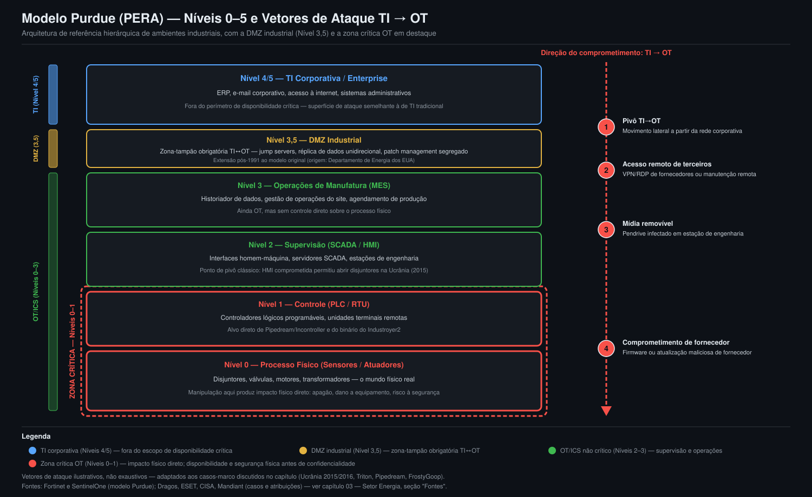

# 03 — Setor Energia / OT

> **Resumo Executivo**
> - *Ransomware* contra organizações industriais acelerou dois anos seguidos: +87% em 2024 (80 grupos
>   ativos) e +64% em 2025 (119 grupos, ~3.300 organizações impactadas), com manufatura respondendo
>   por mais de dois terços das vítimas — mas a energia elétrica já é o 3º setor mais atacado do mundo
>   por volume de objetos maliciosos bloqueados em computadores ICS.
> - A Ucrânia sofreu os dois apagões mais documentados da história causados por ciberataque —
>   BlackEnergy (2015) e Industroyer/CrashOverride (2016) — e uma tentativa neutralizada em 2022
>   (Industroyer2), todos atribuídos ao grupo Sandworm por múltiplas fontes ocidentais (governo dos
>   EUA, ESET, Dragos).
> - Colonial Pipeline (2021) mostrou que um *ransomware* restrito a sistemas de TI corporativa pode
>   forçar o desligamento preventivo de um duto crítico — sem nunca comprometer diretamente o
>   controle industrial —, interrompendo cerca de 45% do combustível consumido na Costa Leste dos
>   EUA.
> - Atores estatais mudaram de tática: em vez de sabotagem imediata, Volt Typhoon/VOLTZITE
>   pré-posiciona-se silenciosamente em infraestrutura crítica dos EUA (caso documentado: ~300 dias de
>   permanência em uma concessionária elétrica de Massachusetts antes da detecção).
> - No Brasil, a ANEEL estabeleceu em 2021 o marco regulatório central de cibersegurança do setor
>   elétrico (RN nº 964/2021, ARCiber), mas a primeira fiscalização concreta só ocorreu em 2025;
>   incidentes conhecidos (Eletrobras/Copel 2021, Petrobras/Everest 2025) mostram, até aqui,
>   segmentação bem-sucedida entre TI corporativa comprometida e OT crítico preservado.
> - **Número-chave:** no 1º semestre de 2025, **22,8%** dos computadores ICS do setor de energia
>   elétrica tiveram objetos maliciosos bloqueados — 3º setor mais atacado globalmente, atrás apenas
>   de biometria e automação predial [1][2].

## Contexto Global

Este capítulo aprofunda, para o setor de energia — em especial o segmento elétrico —, o macro-cenário
já estabelecido no capítulo 01 (Panorama Global). A leitura segue do executivo ao técnico: primeiro por
que tecnologia operacional (OT) e sistemas de controle industrial (ICS, na sigla em inglês) exigem um
modelo de risco distinto do de TI tradicional; depois o panorama de ameaças por relatório de referência
(Dragos, Kaspersky, Fortinet, Nozomi, CISA, IBM); em seguida os casos-marco que definiram a categoria de
ciberataque contra infraestrutura elétrica, sempre com a atribuição citada explicitamente à fonte que a
fez; os fundamentos técnicos (Modelo Purdue, IEC 62443); e, na segunda metade do capítulo, o recorte
brasileiro — regulação da ANEEL e do ONS, e incidentes conhecidos.

**Nota de precisão desta seção:** atribuição de grupos/APTs e detalhes técnicos de malware ICS são áreas
de alta imprecisão pública. Cada afirmação de atribuição neste capítulo é atribuída explicitamente a
quem a fez (Dragos, Mandiant, ESET, CISA etc.), e não tratada como fato objetivo estabelecido por esta
pesquisa.

| Indicador                                                          | Valor                                          | Fonte primária          |
|:------------------------------------------------------------------|:------------------------------------------------|:-----------------------------|
| *Ransomware* contra orgs. industriais (2023→2024)                   | +87% a/a; 80 grupos ativos (+60%)              | Dragos [1][2]                |
| *Ransomware* contra orgs. industriais (2024→2025)                   | +64% a/a; 119 grupos; ~3.300 orgs. impactadas | Dragos [3][4]                |
| *Dwell time* de *ransomware* em ambientes OT                        | 42 dias (5 dias com visibilidade OT plena)     | Dragos [3][4]                |
| Computadores ICS atacados — energia elétrica (1º sem. 2025)        | 22,8% (3º setor mais atacado globalmente)      | Kaspersky ICS CERT [50][51]  |
| Computadores ICS atacados — global (1º tri. 2026)                   | 19,6% (menor patamar em três anos)             | Kaspersky ICS CERT [50][52]  |
| Incidentes de cibersegurança em OT (organizações pesquisadas)       | 50% relataram ≥ 1 incidente no último ano      | Fortinet [5][6]              |
| Técnica dominante em ambientes Energia/Utilities/Resíduos           | Manipulação de Dados (3x mais frequente)       | Nozomi Networks [7][8]       |
| Advisórios ICS publicados pela CISA (2025)                         | > 450, 200+ fornecedores, 700+ produtos        | Agregação sobre CISA [9][10] |
| Incidentes com impacto em OT — custo médio (cross-setorial, ed. 2025) | USD 4,56 milhões (15% das organizações afetadas) | IBM [11][12]                |
| Custo médio de violação — setor de energia (qualquer violação)      | USD 5,2 milhões (ante USD 4,83 milhões em 2025) | IBM [46][47]                 |

### Por que OT/ICS é diferente de TI

A diferença central entre tecnologia operacional (OT) e TI corporativa não é apenas técnica, é de
prioridade: em TI, a tríade clássica prioriza confidencialidade, depois integridade e disponibilidade;
em OT, a ordem se inverte — disponibilidade e segurança física (*safety*) vêm antes de confidencialidade,
porque uma interrupção ou manipulação do processo controlado (uma subestação, um duto, uma planta
petroquímica) pode causar apagão, dano a equipamento ou risco à vida, não apenas exposição de dados.
Três fatores agravam esse risco: (1) sistemas legados com ciclo de vida de décadas, frequentemente sem
suporte de segurança do fabricante e difíceis de corrigir sem interromper o processo produtivo; (2) a
convergência acelerada entre TI e OT — motivada por ganhos de eficiência via telemetria, manutenção
remota e integração com nuvem — que expõe redes historicamente isoladas (*air-gapped*) a vetores de
ataque antes só relevantes para TI; e (3) a natureza física do impacto, que transforma um incidente
cibernético em um evento potencialmente humano e não apenas financeiro ou reputacional. O restante desta
seção detalha como esses fatores se manifestam em números e em casos concretos.

### Ransomware industrial: aceleração em dois anos consecutivos

O relatório *2025 OT/ICS Cybersecurity Year in Review* da Dragos (8ª edição, dados de 2024) registrou
que ataques de *ransomware* contra organizações industriais cresceram **mais de 87%** em relação a 2023,
com o número de grupos de *ransomware* mirando esse universo subindo para **80** (alta de 60% frente aos
50 grupos de 2023); manufatura respondeu por mais de 50% das vítimas observadas, e em média **34
organizações industriais por semana** foram atacadas no 1º semestre de 2024 — número que mais que
dobrou no 2º semestre [1][2]. A 9ª edição do mesmo relatório (dados de 2025) mostrou que a tendência não
desacelerou: atividade geral de *ransomware* cresceu **64%** ano a ano, o número de grupos mirando
setores industriais subiu para **119**, impactando coletivamente cerca de **3.300 organizações**, e
manufatura passou a responder por mais de dois terços de todas as vítimas reportadas [3][4]. Um dado
operacionalmente relevante: o tempo médio de permanência (*dwell time*) de *ransomware* em ambientes OT
foi de **42 dias** em 2025, mas organizações com visibilidade OT abrangente conseguiram conter incidentes
em média em apenas **5 dias** — uma diferença de quase 8x que ilustra o valor concreto de instrumentação
e monitoramento OT dedicados [3][4]. Malware confirmado e *ransomware* corresponderam, cada um, a 23% dos
engajamentos de resposta a incidentes da Dragos ao longo de 2025 [3][4].

### Vulnerabilidades, superfície de exposição e técnica dominante

A Kaspersky ICS CERT mediu, ao longo de 2025, entre **20,1% e 21,9%** de computadores ICS globais com
objetos maliciosos bloqueados por trimestre, e a série seguiu **em queda** desde então: **19,7%** no 4º
trimestre de 2025 e **19,6%** no 1º trimestre de 2026 — o menor patamar em três anos, uma redução de
**1,35 vez** no acumulado do período [50][51][52]. A dispersão regional é muito maior que a variação
global: no 1º trimestre de 2026 o indicador foi de **9,1%** no Norte da Europa a **27,4%** na África
[50][52]. No recorte específico do setor de **energia elétrica**, o 1º semestre de 2025 registrou
**22,8%**, tornando o setor o **3º mais atacado globalmente**, atrás apenas de biometria (28,1%) e
automação predial (25%) [50][51]. A internet permanece a principal fonte de infecção — **7,88%** dos
computadores ICS no 1º trimestre de 2026 (ante ~10% no 1T2025) —, seguida por clientes de e-mail
(**2,59%**) e mídia removível (**0,26%**, em queda contínua) [50].

**Duas notas de precisão.** Primeira: o detalhamento setorial exato (biometria/energia/óleo e gás) não
foi confirmado linha a linha contra o documento primário de cada trimestre — o valor foi obtido por
agregação de cobertura especializada que cita a mesma série trimestral da Kaspersky, e é tratado aqui
como parcialmente confirmado [51]. Segunda: os relatórios do 4º trimestre de 2025 e do 1º trimestre de
2026 **não publicam tabela setorial consolidada**, apenas o setor que subiu no trimestre (óleo e gás no
4T2025; manufatura, +1,0 p.p., no 1T2026) [50][52]. Por isso os **22,8%** do 1º semestre de 2025
seguem sendo o dado setorial mais recente disponível para energia elétrica — a queda do indicador
global **não** deve ser lida como queda equivalente no setor elétrico, que não foi medido de novo.

A CISA publicou mais de **450 advisórios ICS** em 2025, cobrindo vulnerabilidades em mais de 200
fornecedores e mais de 700 produtos usados em linhas de manufatura, subestações, salas de controle e
redes industriais — incluindo o setor de energia; esse número também não foi verificado contra o índice
primário completo da CISA, sendo tratado como parcialmente confirmado [9][10]. Já a Nozomi Networks
identificou que **"Manipulação de Dados"** (*Data Manipulation*) foi a técnica mais detectada em
ambientes de clientes ao longo de 2025 — três vezes mais frequente que a segunda técnica mais detectada
— e também a técnica dominante especificamente nos três setores mais monitorados: Manufatura, Transporte
e **Energia, Utilities e Resíduos** [7][8]. Em análise de mais de 500 mil redes sem fio no mundo, apenas
**6%** estavam adequadamente protegidas contra ataques de desautenticação (*deauth*) sem fio — vetor
usado para obter acesso profundo a infraestrutura crítica [7][8]. A pesquisa *2025 State of Operational
Technology and Cybersecurity* da Fortinet, com mais de 550 profissionais de OT em múltiplos setores
críticos (incluindo energia), constatou que **50%** das organizações relataram um ou mais incidentes de
cibersegurança no último ano, ainda que interrupções operacionais com impacto em receita tenham caído de
52% (2024) para 42% (2025); **52%** das organizações já colocam a segurança OT sob responsabilidade do
CISO, ante apenas 16% em 2022 [5][6].

### Custo de um incidente com impacto em OT

A edição **2026** do *Cost of a Data Breach Report* da IBM mediu o custo médio de violação
especificamente do setor de energia em **USD 5,2 milhões** — alta frente aos USD 4,83 milhões da edição
2025 [11][13], acompanhando o movimento geral de alta de 12% no custo médio global (que também subiu,
para USD 4,99 milhões, revertendo a queda da edição anterior) [46][47]. Energia está, junto com o setor financeiro,
entre os setores de maior concentração de ataques habilitados por IA dentro do grupo mais amplo de
infraestrutura crítica (62% desse tipo de ataque, segundo a mesma edição 2026) [46][47]. A edição **2025**
do mesmo relatório havia detalhado, especificamente, o recorte de incidentes com impacto em tecnologia
operacional (OT): **15%** das organizações estudadas sofreram incidentes de cibersegurança que afetaram
seu ambiente de OT; desse grupo, quase um quarto (~25%) relatou dano a sistemas ou equipamentos de OT.
Incidentes com impacto em OT custaram, em média, **USD 4,56 milhões** — acima da média global daquela
edição, USD 4,44 milhões [11][12]. Este número é distinto (e não deve ser confundido) do custo médio de
violação do setor de energia como um todo, atualizado acima: o primeiro mede incidentes com impacto em OT
em qualquer setor; o segundo mede qualquer violação de dados no setor de energia, com ou sem impacto em
OT. **Nota de atualização:** não foi localizado, no escopo desta pesquisa, um detalhamento equivalente
específico de impacto em OT (15%/25%/USD 4,56 milhões) para a edição 2026 — o valor de 2025 permanece
como referência mais recente confirmada para esse recorte específico. Como referência de severidade
regulatória internacional — fora do escopo direto deste capítulo, mas relevante como contraponto ao que
será discutido na seção Brasil —, a norma **NERC CIP** (North American Electric Reliability Corporation
Critical Infrastructure Protection), aplicável ao setor elétrico dos EUA, prevê multas de até **USD 1
milhão por dia por violação** em caso de não conformidade [11][12].

### Casos-marco: das redes elétricas ucranianas ao Pipedream

A tabela a seguir organiza, em ordem cronológica, os incidentes e famílias de malware ICS mais citados
na literatura técnica como marcos da categoria — cada atribuição de ator é creditada explicitamente à
fonte que a fez, nunca tratada como fato único e definitivo.

| Ano             | Evento                                                        | Ator (segundo quem)                                                | Impacto                                                                     |
|:-----------------|:----------------------------------------------------------------|:------------------------------------------------------------------------|:---------------------------------------------------------------------------------|
| 2015 (23/12)     | BlackEnergy 3 — apagão em três distribuidoras ucranianas        | Sandworm, segundo CISA/E-ISAC/SANS ICS, ESET e Dragos [14][15]          | 225–230 mil clientes sem energia por 1–6 horas; 1º apagão confirmado por ciberataque |
| 2016 (17/12)     | Industroyer / CrashOverride — apagão em Kyiv                    | Sandworm/ELECTRUM, segundo ESET e Dragos [16][17]                       | ~1/5 de Kyiv sem energia por ~1 hora; 1º malware conhecido *purpose-built* p/ redes elétricas |
| 2017 (jun–ago)   | Triton / Trisis / HatMan — SIS comprometido em petroquímica saudita | Instituto de pesquisa estatal russo, segundo FireEye/Mandiant — **não confirmado de forma independente** [18][19] | Sistema instrumentado de segurança desabilitado; sem dano físico confirmado          |
| 2021 (7/5)       | Colonial Pipeline — *ransomware* em sistemas de TI corporativa   | DarkSide (grupo de *ransomware* financeiramente motivado) [20][21]     | Duto (45% do combustível da Costa Leste dos EUA) desligado por precaução; resgate de 75 BTC (~USD 4,4 mi) |
| 2022 (8/4)       | Industroyer2 — tentativa de apagão contra distribuidora ucraniana | Sandworm, segundo ESET e CERT-UA [22][23]                              | ~2 milhões de pessoas na área de cobertura; apagão evitado por intervenção do CERT-UA |
| 2022 (13/4)      | Pipedream / Incontroller — *framework* modular contra PLCs      | CHERNOVITE, segundo Dragos (alta confiança); Mandiant nota consistência com interesse histórico russo [24][25] | Sem uso ativo confirmado até a data do advisório conjunto CISA/FBI/NSA/DOE          |
| 2024 (jan.; identificado em abr.) | FrostyGoop — interrupção de aquecimento distrital em Lviv, Ucrânia | Não identificado — nenhuma atribuição de grupo de ameaça localizada, segundo Dragos [26][27] | Mais de 600 prédios residenciais; ~2 dias sem aquecimento em temperaturas negativas   |
| 2025 (29/12); 2ª instalação revelada em 9/8/2026 | Pivô por APN celular privada — de parque eólico a usina de cogeração (CHP) na Polônia | Sandworm, segundo ESET (Dragos também associa); Static Tundra/FSB, segundo CERT Polska — atribuição contestada [48][49] | ~30 instalações eólicas/solares comprometidas; turbina a vapor e estação de tratamento de água de usina CHP (50 mil residentes) desligadas por sabotagem; sem interrupção ao público; 1º caso documentado de pivô TI→OT via APN privada |
| 2026 (jul.; revelado em 23/8/2026) | Pequeno gerador de energia desligado por 4 dias no Reino Unido | Ligado ao Irã, segundo o *The Telegraph* — nome do grupo/APT não identificado [53][54] | Instalação de pequena escala; sem risco à rede nacional; 1º ataque desse tipo bem-sucedido contra infraestrutura de energia britânica, segundo autoridades |

O padrão histórico é revelador: o ataque de 2015 dependeu de acesso manual a interfaces homem-máquina
(HMI) após meses de *spear-phishing* e movimento lateral da rede de TI corporativa até o SCADA; o
Industroyer/CrashOverride de 2016 já dispensava esse passo, comunicando-se diretamente com protocolos
industriais (IEC 60870-5-101/104, IEC 61850, OPC) para abrir disjuntores de subestação [16][17]. O
Industroyer2 (2022) levou essa lógica adiante: um binário Windows único, com endereços de objetos de
informação IEC 60870-5-104 codificados especificamente para a subestação-alvo, foi agendado para
execução às 16h10 UTC do dia 8 de abril de 2022, seguido dez minutos depois pelo *wiper* **CaddyWiper**
para dificultar a recuperação — os atacantes já estavam na rede de TI da concessionária desde pelo menos
fevereiro de 2022 [22][23]. O caso Colonial Pipeline ilustra um padrão distinto e igualmente relevante: o
comprometimento nunca atingiu diretamente os sistemas de controle do duto — o acesso inicial ocorreu por
uma conta VPN desativada mas ainda válida, sem MFA — mas a resposta prudente da empresa foi desligar
proativamente a operação física, uma distinção às vezes obscurecida na cobertura popular do caso [20][21].
O caso mais recente da tabela, na Polônia, estende esse padrão de pivô TI→OT a um vetor até então inédito: em
29 de dezembro de 2025 um firewall/VPN FortiGate exposto à internet, sem MFA, em um parque eólico serviu de
ponto de apoio para os atacantes alcançarem, via um roteador celular Teltonika conectado a uma **APN privada**
da distribuidora local, uma usina de cogeração (CHP) não relacionada, onde CLPs Siemens foram colocados em
modo STOP. O CERT Polska classificou esse movimento — pivô entre instalações sem relação direta, unidas apenas
por compartilharem a mesma rede celular privada de um operador — como o primeiro caso documentado desse tipo.
Em 9 de agosto de 2026, no DEF CON, o CERT Polska revelou que uma segunda instalação menor havia sido
comprometida pela mesma campanha por meio de um controlador WAGO PFC200 com credenciais padrão, achado cuja
análise levou mais de três meses e por isso ficou fora do relatório original de janeiro de 2026 [48][49]. Mais
um episódio de sabotagem contra infraestrutura de energia foi revelado em 23 de agosto de 2026, quando o
*The Telegraph* noticiou que hackers ligados ao Irã haviam derrubado, em julho de 2026, um pequeno gerador de
energia no Reino Unido por quatro dias — sem afetar a rede nacional, mas descrito por autoridades britânicas
como o primeiro caso desse tipo bem-sucedido contra o setor de energia do país; o nome do grupo/APT responsável
não foi identificado nas fontes consultadas [53][54].

Poucos dias depois, em 26 de agosto de 2026, o governo dos EUA deu uma resposta regulatória de peso a esse tipo
de ameaça: o presidente assinou a **Ordem Executiva 14420**, declarando **emergência nacional** sobre riscos
associados a equipamentos elétricos do sistema de energia em massa (*bulk-power system*) produzidos no exterior,
citando explicitamente riscos de cibersegurança, acesso remoto não autorizado, sabotagem e disrupção de cadeia de
suprimentos. A ordem autoriza o Departamento de Energia dos EUA (DOE) a proibir, condicionar ou desfazer
transações envolvendo esses equipamentos, com prazo de **120 dias** (até 24/12/2026) para regras de implementação
e **180 dias** (até 22/2/2027) para recomendações de revisão do regulamento federal de aquisições (FAR) [55][56].
É a primeira declaração formal de emergência nacional dos EUA motivada especificamente por risco
cibernético/cadeia de suprimentos ao sistema elétrico identificada nesta pesquisa — as regras de implementação do
DOE ainda não haviam sido publicadas até a data desta atualização, então o efeito prático segue em aberto.

### Atores relevantes: Sandworm/ELECTRUM e Volt Typhoon/VOLTZITE

**Sandworm Team** — também rastreado como APT44, ELECTRUM, Telebots, Voodoo Bear, Seashell Blizzard ou
FROZENBARENTS, conforme o fornecedor de inteligência — é atribuído pelo governo dos EUA à unidade
militar russa **GRU 74455** (Centro Principal de Tecnologias Especiais), ativo desde cerca de 2009. Em
outubro de 2020, o Departamento de Justiça dos EUA indiciou seis oficiais dessa unidade por operações
que incluem os ataques de 2015 e 2016 contra distribuidoras ucranianas, o *NotPetya* de 2017 e o
*Olympic Destroyer* de 2018 [28][29]. Desde novembro de 2022, o mesmo grupo (rastreado pelo
Google/Mandiant como FROZENBARENTS) tem mirado o setor de energia europeu, incluindo um ataque contra o
Caspian Pipeline Consortium [28][29]. **Nota de nomenclatura:** "ELECTRUM" é o nome que a Dragos atribui
especificamente ao grupo associado ao CrashOverride/Industroyer, que a Dragos avalia com
sobreposição/vínculo ao Sandworm mais amplo — mas os nomes não são sinônimos estritos em todas as fontes
[28][29].

Em 7 de fevereiro de 2024, CISA, NSA e FBI publicaram o advisório conjunto **AA24-038A**, alertando que
atores estatais da República Popular da China — rastreados pela Microsoft como **Volt Typhoon** — se
pré-posicionam em redes de TI de infraestrutura crítica dos EUA (Comunicações, Energia, Sistemas de
Transporte e Água/Esgoto) para possibilitar ciberataques disruptivos em caso de crise futura, usando
técnicas *living-off-the-land* para evitar detecção [30][31]. A Dragos rastreia um subgrupo com foco
específico em OT sob o nome **VOLTZITE**. Em um caso documentado, a concessionária municipal **Littleton
Electric Light and Water Departments (LELWD)**, em Massachusetts, foi comprometida por cerca de **300
dias** (fevereiro a novembro de 2023) antes de o FBI alertar a empresa; o objetivo observado foi
exfiltração de dados operacionais de OT (procedimentos de operação, layout da rede elétrica), não
disrupção imediata [30][31]. A Dragos afirma que a atividade da VOLTZITE contra infraestrutura crítica
ocidental continuou ao longo de 2025 — registrado aqui como atribuição da própria Dragos.

### Fundamentos técnicos: Modelo Purdue e IEC 62443

O **Modelo Purdue** (Purdue Enterprise Reference Architecture, 1991) organiza ambientes industriais em
níveis hierárquicos, do processo físico (Nível 0) à TI corporativa (Níveis 4–5). Devido à convergência
TI/OT, uma extensão amplamente adotada — originada de trabalho do Departamento de Energia dos EUA —
insere um **Nível 3,5, a DMZ industrial**, como zona-tampão obrigatória entre OT e TI, já que a separação
física original deixou de ser suficiente com o aumento do fluxo de dados entre a camada de processo e a
nuvem/TI corporativa [32][33]. A Figura 1 detalha os seis níveis e anota quatro vetores de ataque
típicos pelos quais uma ameaça desce da TI corporativa até a OT crítica.

| Nível | Camada                              | Exemplos típicos                             | Papel na disponibilidade/segurança                                  |
|:-------:|:--------------------------------------|:-----------------------------------------------|:-------------------------------------------------------------------------|
| 0      | Processo físico                       | Sensores, atuadores, disjuntores, válvulas    | Impacto físico direto — máxima criticidade de disponibilidade e segurança |
| 1      | Controle                              | PLCs, RTUs                                    | Execução direta de comandos de controle — zona crítica                  |
| 2      | Supervisão                            | SCADA, HMI                                    | Visibilidade e controle remoto do processo — ponto de pivô histórico     |
| 3      | Operações de manufatura               | MES, historiador de dados                     | Gestão de operações do site — ainda OT, mas sem controle direto do processo |
| 3,5    | DMZ industrial                        | *Jump servers*, proxies de dados              | Zona-tampão obrigatória TI↔OT (extensão pós-1991)                        |
| 4/5    | TI corporativa / Enterprise           | ERP, e-mail corporativo, internet             | Fora do perímetro de disponibilidade crítica                            |

*Figura 1 — Modelo Purdue (níveis 0–5, com a DMZ industrial no nível 3,5), zona crítica OT em destaque e
quatro vetores de ataque anotados pelos quais uma ameaça desce da TI corporativa até a OT — pivô TI→OT,
acesso remoto de terceiros, mídia removível e comprometimento de fornecedor/cadeia de suprimentos, todos
inspirados nos casos-marco discutidos acima [32][33].*

A série **ISA/IEC 62443** é o principal conjunto de normas internacionais de cibersegurança para sistemas
de automação e controle industrial (IACS), organizada em quatro grupos — Fundamentos, Políticas e
Procedimentos, Sistema e Componente —, com o modelo de **zonas e conduítes** construído diretamente sobre
a hierarquia do Modelo Purdue, mapeando cada nível a uma zona de segurança com um **Nível de Segurança
(SL 1 a 4)** correspondente [34][35]. A norma define sete requisitos fundamentais: controle de
identificação e autenticação, controle de uso, integridade do sistema, confidencialidade de dados,
restrição de fluxo de dados, resposta oportuna a eventos e disponibilidade de recursos [34][35]. A IEC
62443 é referenciada na Figura 2, adiante, como referência técnica internacional que operacionaliza, na
prática, as exigências mais genéricas da regulação brasileira.

## Recorte Brasil

O Brasil tem, desde 2021, um marco regulatório central de cibersegurança dedicado ao setor elétrico —
mas a fiscalização efetiva desse marco só começou a se materializar em 2025, e a camada operacional do
Operador Nacional do Sistema Elétrico (ONS) segue, segundo as fontes consultadas, em processo de
consolidação.

### Regulação do setor elétrico: ANEEL, ONS e o ARCiber

A **Resolução CNPE nº 24/2021** atribuiu à ANEEL a coordenação de ações setoriais de resposta a
incidentes cibernéticos, preparando o terreno para o marco regulatório propriamente dito: a **Resolução
Normativa ANEEL nº 964, de 14 de dezembro de 2021** (em vigor desde 1º de julho de 2022), que estabelece
diretrizes e conteúdo mínimo de políticas de segurança cibernética para concessionárias, permissionárias,
autorizadas e demais agentes do setor elétrico, incluindo o próprio ONS [36][37]. A resolução define o
**ARCiber (Ambiente Regulado Cibernético)**, composto pelos centros de operação dos agentes, pelos
equipamentos de infraestrutura de troca de dados/voz para o ambiente operacional do ONS ou de outros
agentes, e pelo próprio ambiente operacional do ONS [36][37].

Em paralelo, o ONS encaminhou à ANEEL, em 10 de dezembro de 2019, uma proposta de submódulo dos
**Procedimentos de Rede** destinada a estabelecer os controles técnicos de segurança cibernética a serem
implementados no ARCiber, com cronograma de implementação previsto em três ondas consecutivas — a 18, 27
e 36 meses após o início de vigência do submódulo [38][39]. **Nota de precisão:** o número exato desse
submódulo (ex.: 25.4, 25.9 ou outro) e sua data final de aprovação/vigência não foram localizados com
precisão nesta pesquisa; as fontes disponíveis confirmam a proposta original (dez/2019) e o cronograma de
três ondas, mas não o número definitivo nem eventual renumeração posterior — recomenda-se verificação
manual direta no site de Procedimentos de Rede do ONS antes de uso deste dado fora deste capítulo
[38][39]. Essa lacuna ilustra um padrão relevante: enquanto a camada regulatória (ANEEL) já está em
vigor e sob fiscalização, a camada operacional específica do ONS para cibersegurança segue, nas fontes
disponíveis, sem confirmação pública de conclusão.

A primeira fiscalização concreta veio somente quatro anos depois: por meio do **Despacho ANEEL nº 427,
de 17 de fevereiro de 2025**, os agentes do setor elétrico tiveram até **30 de junho de 2025** para
enviar à ANEEL as informações necessárias ao acompanhamento da implementação de suas políticas de
segurança cibernética, conforme exigido pela RN nº 964/2021 [40][41]. A Figura 2 organiza essas camadas
regulatórias em linha do tempo, incluindo a referência técnica internacional da IEC 62443 (não é norma
brasileira, mas é amplamente usada para operacionalizar os requisitos mais genéricos da RN 964/2021) e a
lacuna do submódulo ONS ainda sem confirmação de número/vigência final.

*Figura 2 — Linha do tempo das camadas regulatórias e de referência técnica que incidem sobre o setor
elétrico brasileiro, de 2019 (proposta original do ONS) a 2026, incluindo a lacuna registrada quanto ao
submódulo de cibersegurança dos Procedimentos de Rede [36][37][38][39][40][41].*

### Incidentes conhecidos no setor de energia brasileiro

No início de fevereiro de 2021, duas grandes empresas de energia brasileiras sofreram ataques de
*ransomware* na mesma semana. Na **Eletrobras**, o incidente ocorreu na subsidiária **Eletronuclear** e
afetou servidores da rede administrativa, sem impacto nas usinas nucleares Angra 1 e Angra 2 — fisicamente
desconectadas da rede administrativa — nem no Sistema Interligado Nacional [42][43]. Na **Copel**
(Companhia Paranaense de Energia), o ataque foi atribuído ao grupo de *ransomware* **DarkSide**, que
alegou ter roubado mais de **1.000 GB de dados**, incluindo informações de acesso a infraestrutura
sensível e dados pessoais de executivos e clientes — os atacantes alegaram ter obtido acesso à solução de
gestão de acessos privilegiados **CyberArk** da empresa e exfiltrado senhas em texto claro de sua
infraestrutura local e de internet [42][43]. Ambos os incidentes ilustram um padrão recorrente também
observado no setor financeiro (capítulo 02): sistemas administrativos de TI comprometidos, com
segmentação bem-sucedida evitando impacto nos sistemas de operação/OT críticos.

Em **14 de novembro de 2025**, o grupo de *ransomware*/extorsão **Everest** publicou em seu site de
vazamento a alegação de ter invadido a **Petrobras** e sua parceira **SAExploration** (contratada de
dados sísmicos), afirmando ter roubado mais de **176 GB** de dados de navegação sísmica, dos quais mais de
**90 GB** pertenceriam diretamente à Petrobras — incluindo posicionamento de embarcações, configurações
de equipamentos e leituras de hidrofones [44][45]. A Petrobras declarou que a violação envolve um
**terceiro** (a contratada) e que seus próprios sistemas permanecem íntegros [44][45]. **Esta divergência
entre a alegação do grupo atacante e a posição oficial da empresa permanece contestada** e não foi
possível arbitrá-la com certeza no escopo desta pesquisa — o mesmo padrão de contestação já registrado no
caso do Banco Neon, no capítulo 02.

## Ameaças × impacto no setor de energia

| Ameaça                                                    | Probabilidade | Impacto  | Evidência                                                                    |
|:-------------------------------------------------------------|:----------------:|:-----------:|:----------------------------------------------------------------------------------|
| *Ransomware* direto contra organizações industriais            | Alta            | Crítico    | Dragos: +64% a/a, 119 grupos, ~3.300 orgs. impactadas em 2025 [3][4]              |
| Manipulação de dados em ambientes Energia/Utilities            | Média-Alta      | Alto       | Técnica dominante, 3x mais frequente que a 2ª mais detectada (Nozomi) [7][8]      |
| Pré-posicionamento silencioso de ator estatal (Volt Typhoon)   | Média           | Crítico    | Caso LELWD: ~300 dias de permanência sem disrupção imediata [30][31]              |
| Malware *purpose-built* para ICS elétrico (classe Industroyer)  | Baixa           | Crítico    | Industroyer, Industroyer2, FrostyGoop — 3 casos documentados em 6 anos [16][17][22][23][26][27] |
| *Ransomware* em TI com impacto colateral em OT (padrão Colonial) | Alta           | Alto       | Colonial Pipeline: desligamento preventivo, 45% do combustível da Costa Leste dos EUA [20][21] |
| Comprometimento de fornecedor/terceiro (cadeia de suprimentos)  | Média          | Alto       | Petrobras/SAExploration (contestado); padrão já visto no setor financeiro [44][45] |

## Obrigações regulatórias do setor elétrico brasileiro

| Norma / iniciativa                                          | Órgão emissor            | Escopo                                             | Exigência-chave                                     | Prazo / status                             |
|:----------------------------------------------------------------|:------------------------------|:------------------------------------------------------|:-------------------------------------------------------|:-------------------------------------------------|
| LGPD (Lei nº 13.709/2018)                                    | Congresso Nacional / ANPD | Todos os setores, dados pessoais                   | Consentimento e governança de dados                  | Em vigor desde 2020 (transversal)                |
| Resolução CNPE nº 24/2021                                    | CNPE                       | Coordenação setorial de resposta a incidentes       | Atribui à ANEEL a coordenação setorial                | Em vigor                                          |
| RN ANEEL nº 964/2021                                        | ANEEL                      | Concessionárias, permissionárias, autorizadas, ONS  | Política de segurança cibernética + define o ARCiber  | Vigente desde 1º/7/2022                          |
| Submódulo de cibersegurança dos Procedimentos de Rede (ONS)  | ONS / ANEEL                | Centros de operação e infraestrutura ONS↔agentes    | Controles técnicos de segurança cibernética no ARCiber | Proposto em dez/2019; número/vigência final não confirmados |
| Despacho ANEEL nº 427/2025                                   | ANEEL                      | Todos os agentes sob a RN nº 964/2021               | Envio de informações sobre implementação da política  | Prazo encerrado em 30/6/2025                     |
| ISA/IEC 62443                                                | ISA/IEC (internacional)   | IACS em geral — referência técnica                  | Zonas, conduítes, Níveis de Segurança (SL 1–4)        | Referência técnica; não é lei brasileira         |

## Fontes

[1] Dragos. *Dragos Reports OT/ICS Cyber Threats Escalate Amid Geopolitical Conflicts and Increasing
Ransomware Attacks (2025 OT/ICS Cybersecurity Year in Review)*. Fevereiro de 2025.
https://www.dragos.com/resources/press-release/dragos-reports-ot-ics-cyber-threats-escalate-amid-geopolitical-conflicts-and-increasing-ransomware-attacks

[2] TechTarget. *Dragos: Ransomware attacks against industrial orgs up 87%*. 2025.
https://www.techtarget.com/searchsecurity/news/366619652/Dragos-Ransomware-attacks-against-industrial-orgs-up-87

[3] Dragos. *Dragos 2026 OT Report Shows Surge in Threat Groups and Ransomware*. Fevereiro de 2026.
https://www.dragos.com/resources/press-release/dragos-2026-year-in-review-new-ot-threats-ransomware

[4] Cybersecurity Magazine. *Dragos: Operational Tech Under Increasing Risk of Attack*. 2026.
https://cybermagazine.com/news/dragos-ot-ics-cybersecurity-report

[5] Fortinet. *2025 State of Operational Technology and Cybersecurity Report*. 2025.
https://www.fortinet.com/resources/reports/state-ot-cybersecurity

[6] Industrial Cyber. *OT cybersecurity becomes a board-level priority as industrial security maturity
rises, Fortinet finds*. 2025.
https://industrialcyber.co/industrial-cyber-attacks/ot-cybersecurity-becomes-a-board-level-priority-as-industrial-security-maturity-rises-fortinet-finds/

[7] Nozomi Networks. *OT/IoT Cybersecurity Trends & Insights, February 2025* / *Nozomi Networks Assesses
the 2025 OT/IoT Cybersecurity Threat Landscape (July 2025)*. 2025.
https://www.nozominetworks.com/ot-iot-cybersecurity-trends-insights-february-2025

[8] PR Newswire. *Nozomi Networks Labs Report Finds Wireless Networks Unprotected as Threats to Critical
Infrastructure Escalate*. 2025.
https://www.prnewswire.com/news-releases/nozomi-networks-labs-report-finds-wireless-networks-unprotected-as-threats-to-critical-infrastructure-escalate-302385820.html

[9] SOCRadar. *CISA Industrial Control Systems (ICS) Advisories Recap for 2025*. 2025.
https://socradar.io/blog/cisa-industrial-control-systems-ics-advisories-2025/

[10] CyberSecurityNews. *CISA Releases Five ICS Advisories Covering Vulnerabilities, and Exploits
Surrounding ICS*. 2025. https://cybersecuritynews.com/cisa-releases-five-ics-advisories-covering-vulnerabilities/

[11] IBM. *Cost of a Data Breach Report 2025*. 2025. https://www.ibm.com/reports/data-breach

[12] DeepStrike. *Energy and Utilities Cybersecurity Statistics 2026: OT & Grid Risk*. 2026.
https://deepstrike.io/blog/energy-utilities-cybersecurity-statistics

[13] DataBreachCost.com. *Data Breach Cost by Industry (IBM 2025)*. 2025.
https://databreachcost.com/by-industry

[14] CISA. *Cyber-Attack Against Ukrainian Critical Infrastructure (IR-ALERT-H-16-056-01)*. 2016.
https://www.cisa.gov/news-events/ics-alerts/ir-alert-h-16-056-01

[15] E-ISAC / SANS ICS. *Analysis of the Cyber Attack on the Ukrainian Power Grid (TLP:White)*. 2016.
https://media.kasperskycontenthub.com/wp-content/uploads/sites/43/2016/05/20081514/E-ISAC_SANS_Ukraine_DUC_5.pdf

[16] SecurityWeek. *'Industroyer' ICS Malware Linked to Ukraine Power Grid Attack*. 2017.
https://www.securityweek.com/industroyer-ics-malware-linked-ukraine-power-grid-attack/

[17] Wikipedia. *Industroyer*. https://en.wikipedia.org/wiki/Industroyer

[18] Wikipedia. *Triton (malware)*. https://en.wikipedia.org/wiki/Triton_(malware)

[19] MIT Technology Review. *Triton is the world's most murderous malware, and it's spreading*. Março de
2019. https://www.technologyreview.com/2019/03/05/103328/cybersecurity-critical-infrastructure-triton-malware/

[20] Departamento de Energia dos EUA (DOE/CESER). *Colonial Pipeline Cyber Incident*.
https://www.energy.gov/ceser/colonial-pipeline-cyber-incident

[21] Wikipedia. *Colonial Pipeline ransomware attack*. https://en.wikipedia.org/wiki/Colonial_Pipeline_ransomware_attack

[22] ESET. *Industroyer2: Industroyer reloaded*. Abril de 2022.
https://www.welivesecurity.com/2022/04/12/industroyer2-industroyer-reloaded/

[23] Claroty Team82. *Industroyer2 Variant Surfaces in Foiled Attack Against Ukraine Electricity
Provider*. 2022. https://claroty.com/team82/blog/industroyer2-variant-surfaces-in-foiled-attack-against-ukraine-electricity-provider

[24] TheHackerNews. *US Warns of APT Hackers Targeting ICS/SCADA Devices*. Abril de 2022.
https://thehackernews.com/2022/04/us-warns-of-apt-hackers-targeting.html

[25] CyberScoop. *Feds warn about foreign government-connected hackers aiming to disrupt vital industrial
systems*. 2022. https://cyberscoop.com/cisa-doe-fbi-nsa-pipedream-chernovite-ics/

[26] Dragos. *How to Protect Against FrostyGoop: ICS Malware Targeting Operational Technology*. 2024.
https://www.dragos.com/blog/protect-against-frostygoop-ics-malware-targeting-operational-technology

[27] The Record (Recorded Future News). *FrostyGoop malware left 600 Ukrainian households without heat
this winter*. 2024. https://therecord.media/frostygoop-malware-ukraine-heat

[28] MITRE ATT&CK. *Sandworm Team, G0034*. https://attack.mitre.org/groups/G0034/

[29] Wikipedia. *Sandworm (hacker group)*. https://en.wikipedia.org/wiki/Sandworm_(hacker_group)

[30] CISA. *PRC State-Sponsored Actors Compromise and Maintain Persistent Access to U.S. Critical
Infrastructure (AA24-038A)*. Fevereiro de 2024.
https://www.cisa.gov/news-events/cybersecurity-advisories/aa24-038a

[31] SecurityWeek. *China's Volt Typhoon Hackers Dwelled in US Electric Grid for 300 Days*. 2026.
https://www.securityweek.com/chinas-volt-typhoon-hackers-dwelled-in-us-electric-grid-for-300-days/

[32] Fortinet. *What Is the Purdue Model? | Fortinet Cyberglossary*.
https://www.fortinet.com/resources/cyberglossary/purdue-model

[33] SentinelOne. *What Is the Purdue Model? Definition, Level & Best Practices*.
https://www.sentinelone.com/cybersecurity-101/cybersecurity/what-is-the-purdue-model/

[34] O Setor Elétrico. *IEC 62443: reforçando a segurança cibernética em infraestrutura crítica*.
https://www.osetoreletrico.com.br/iec-62443-reforcando-a-seguranca-cibernetica-em-infraestrutura-critica/

[35] ISA São Paulo Section. *Cibersegurança Industrial e a Norma ISA/IEC 62443: Essencial para
Engenheiros e Técnicos de Produção*.
https://isasp.org.br/ciberseguranca-industrial-e-a-norma-isa-iec-62443-essencial-para-engenheiros-e-tecnicos-de-producao/

[36] ANEEL. *Resolução normativa Aneel nº 964, de 14 de dezembro de 2021* (texto oficial).
https://www2.aneel.gov.br/cedoc/ren2021964.html

[37] PwC Brasil. *Resolução Normativa da Aneel 964: sua empresa está preparada para cumpri-la?*. 2022.
https://www.pwc.com.br/pt/estudos/setores-atividade/energia/2022/resolucao-normativa-da-aneel-964.html

[38] ONS. *ONS propõe Procedimento de Rede sobre segurança cibernética*. 2020.
https://www.ons.org.br/Paginas/Noticias/20200424-procedimentoderedesegurancacibernetica.aspx

[39] ANEEL. *Análise de Impacto Regulatório (AIR) sobre segurança cibernética no Setor*.
https://www2.aneel.gov.br/cedoc/air2021003srt.pdf

[40] ANEEL. *Agentes do setor elétrico têm até o dia 30 de junho para enviar informações sobre segurança
cibernética*. Fevereiro de 2025.
https://www.gov.br/aneel/pt-br/assuntos/noticias/2025/agentes-do-setor-eletrico-tem-ate-o-dia-30-de-junho-para-enviar-informacoes-sobre-seguranca-cibernetica

[41] ISC Brasil. *Aneel inicia fiscalização da segurança cibernética na redes de energia do país*. 2025.
https://www.iscbrasil.com.br/pt-br/blog/seguranca-publica/aneel-inicia-fiscalizacao-da-seguranca-cibernetica-na-redes-de-e.html

[42] BleepingComputer. *Eletrobras, Copel energy companies hit by ransomware attacks*. 2021.
https://www.bleepingcomputer.com/news/security/eletrobras-copel-energy-companies-hit-by-ransomware-attacks/

[43] Canaltech. *Eletrobras e Copel são vítimas de ataques de ransomware*. 2021.
https://canaltech.com.br/seguranca/eletrobras-e-copel-sao-vitimas-de-ataques-de-ransomware-178557/

[44] Hackread. *Everest Ransomware Says It Breached Brazilian Energy Giant Petrobras*. Novembro de 2025.
https://hackread.com/everest-ransomware-brazil-petrobras-breach/

[45] Cybernews. *Hackers claim oil giant Petrobras, alleging oil-rich maps theft*. 2025.
https://cybernews.com/security/brazil-petrobras-ransomware-attack/

[46] IBM Newsroom. *IBM Study: One in Four Malicious Breaches are AI-Enabled, Costing Companies $6
Million on Average*. 29 de julho de 2026.
https://newsroom.ibm.com/2026-07-29-ibm-study-one-in-four-malicious-breaches-are-ai-enabled,-costing-companies-6-million-on-average

[47] Global News. *Data breach costs mount as attacks target critical infrastructure: IBM*. 2026.
https://globalnews.ca/news/11998290/ibm-data-breach-costs-canada/

[48] ESET WeLiveSecurity. *ESET Research: Sandworm behind cyberattack on Poland's power grid in late 2025*.
Janeiro de 2026.
https://www.welivesecurity.com/en/eset-research/eset-research-sandworm-cyberattack-poland-power-grid-late-2025/

[49] SecurityWeek. *Novel Private APN Pivot Let Hackers Sabotage Second Polish Energy Facility*. Agosto de
2026. https://www.securityweek.com/novel-private-apn-pivot-let-hackers-sabotage-second-polish-energy-facility/

[50] Kaspersky ICS CERT. *Threat landscape for industrial automation systems. Q4 2025* (2 de abril de 2026)
e *Q1 2026* (9 de junho de 2026). 2026.
https://ics-cert.kaspersky.com/publications/reports/2026/04/02/threat-landscape-for-industrial-automation-systems-q4-2025/
e https://ics-cert.kaspersky.com/publications/reports/2026/06/09/threat-landscape-for-industrial-automation-systems-q1-2026/

[51] BusinessWorld. *Malicious Objects Targeted 21.9% Of ICS Computers Globally In Q1 2025: Report*. 2025.
https://www.businessworld.in/article/malicious-objects-targeted-219-of-ics-computers-globally-in-q1-2025-report-557276

[52] ITWeb. *Kaspersky ICS CERT: The beginning of 2026 showed an increase in cyber attacks on the
manufacturing sector*. 8 de julho de 2026.
https://www.itweb.co.za/article/kaspersky-ics-cert-the-beginning-of-2026-showed-an-increase-in-cyber-attacks-on-the-manufacturing-sector/KzQenMjyX5j7Zd2r

[53] CNBC. *Small UK power plant shut down after Iran-linked cyberattack: report*. 23 de agosto de 2026.
https://www.cnbc.com/2026/08/23/small-uk-power-plant-shut-down-after-iran-linked-cyberattack-report.html

[54] SecurityWeek. *Iran-Linked Hackers Shut Down UK Power Plant for Four Days*. Agosto de 2026.
https://www.securityweek.com/iran-linked-hackers-shut-down-uk-power-plant-for-four-days/

[55] The White House. *Declaring a National Emergency to Secure the United States Bulk-Power System*. 26 de
agosto de 2026.
https://www.whitehouse.gov/presidential-actions/2026/08/declaring-a-national-emergency-to-secure-the-united-states-bulk-power-system/

[56] Holland & Knight. *Executive Order Declares National Emergency to Secure U.S. Bulk-Power System*.
Setembro de 2026.
https://www.hklaw.com/en/insights/publications/2026/09/executive-order-declares-national-emergency-to-secure-us
