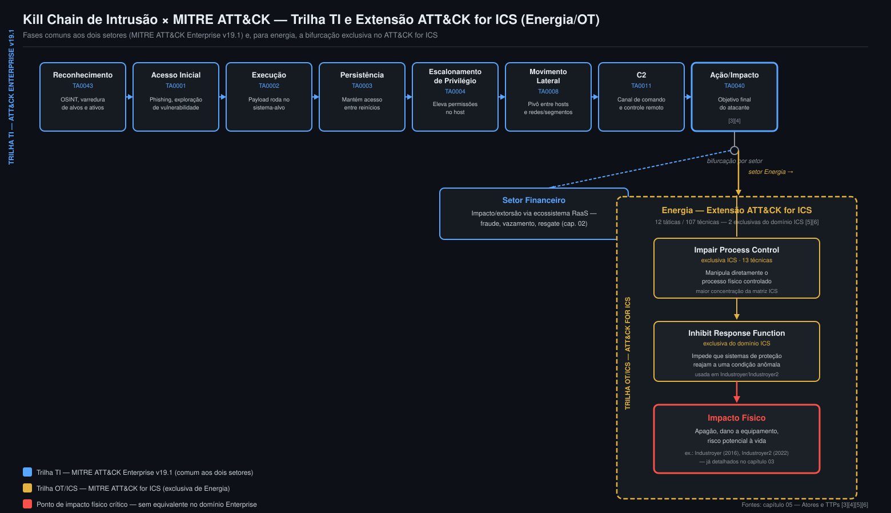
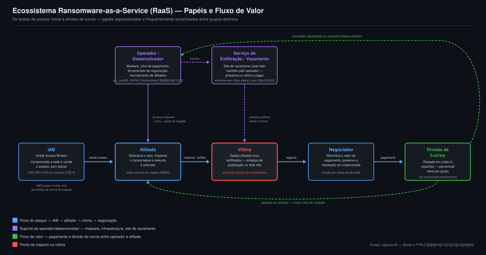

# 05 — Atores e TTPs

> **Resumo Executivo**
> - A indústria de inteligência de ameaças organiza atores em cinco categorias amplas e não
>   excludentes — estado-nação/APT, *ransomware*/RaaS, hacktivismo, insider e *Initial Access
>   Broker* (IAB) —, e a CrowdStrike, só ela, já rastreia mais de **180 atores de ameaça** globais
>   distribuídos entre elas [1][2].
> - Dois frameworks do MITRE sustentam este capítulo: o **ATT&CK Enterprise**, na versão **v19.1**
>   (15 táticas), cobre TI corporativa; o **ATT&CK for ICS** acrescenta 12 táticas e 107 técnicas
>   específicas de ambiente industrial — duas delas sem equivalente em TI [3][4][5][6].
> - O ecossistema *Ransomware-as-a-Service* (RaaS) terceiriza papéis entre grupos distintos, e
>   2024–2025 confirmou um padrão recorrente: a queda ou a traição de um operador dominante — LockBit
>   por ação policial (*Operation Cronos*), ALPHV/BlackCat por *exit scam*, RansomHub por disputa
>   interna — não encerra o ecossistema, apenas realoca afiliados para o concorrente seguinte
>   (Qilin, que dobrou de volume) [7][8][9][10][11][12].
> - IABs são o elo que conecta o acesso inicial comprometido ao ataque final de um afiliado RaaS: o
>   volume de anúncios de acesso à venda mais que dobrou entre 2023 e 2025, com mediana de USD 500
>   por acesso e deslocamento parcial para empresas de menor porte [13][14].
> - **Número-chave:** o MITRE ATT&CK for ICS mapeia **107 técnicas em 12 táticas**, duas delas
>   exclusivas do domínio industrial — *Impair Process Control* (13 técnicas, a maior concentração
>   da matriz) e *Inhibit Response Function* — sem equivalente direto no ATT&CK Enterprise, porque
>   refletem o objetivo físico do atacante contra energia: manipular o processo controlado e
>   impedir que sistemas de proteção reajam a uma condição anômala [5][6].

## Por que este capítulo existe

Os capítulos 02 (Setor Financeiro) e 03 (Setor Energia) já registraram, cada um em seu recorte,
grupos e casos específicos — Qilin e o roubo de ativos digitais ligado à Coreia do Norte no
financeiro; Sandworm, Volt Typhoon e o ecossistema de malware ICS na energia. Este capítulo
consolida a camada técnica comum a ambos: a taxonomia de atores que a indústria usa para
classificá-los, os dois frameworks MITRE que descrevem *como* eles atacam (táticas, técnicas e
procedimentos — TTPs) e o funcionamento interno do ecossistema *Ransomware-as-a-Service* (RaaS), a
cadeia de suprimentos criminosa que hoje sustenta a maior parte do impacto financeiro documentado
nos dois setores. Como já estabelecido nas seções Financeiro e Energia deste dossiê, atribuição de
um ataque a um grupo específico é sempre uma avaliação de terceiros (fornecedor de inteligência,
governo) — nunca um fato objetivo único —, e este capítulo mantém o mesmo padrão: cada atribuição é
creditada explicitamente a quem a fez.

## Taxonomia de Atores de Ameaça

A CrowdStrike, por exemplo, rastreia mais de **180 atores de ameaça** globalmente, distribuídos
entre categorias não excludentes e usando convenção de nomenclatura própria (animal nacional para
estado-nação — "BEAR" para Rússia, "PANDA" para China —; "SPIDER"/"LYNX" para cibercrime financeiro;
"JACKAL" para hacktivismo) [1][2]. As cinco categorias relevantes a este dossiê:

- **Estado-nação / APT** — motivação de espionagem, sabotagem ou pré-posicionamento estratégico,
  raramente lucro imediato. Exemplos: **Sandworm/APT44** — atribuído pelo governo dos EUA à unidade
  militar russa GRU 74455, ativo desde ~2009, autor do *NotPetya* (2017) e indiciado formalmente
  pelo Departamento de Justiça dos EUA (out/2020) pelos ataques às distribuidoras de energia
  ucranianas de 2015 e 2016 [15][16] — e **Volt Typhoon/VOLTZITE** — ator estatal chinês que, segundo
  advisório conjunto de CISA/NSA/FBI (fev/2024), se pré-posiciona silenciosamente em redes de TI de
  infraestrutura crítica dos EUA usando técnicas *living-off-the-land*; um caso documentado mostra
  ~300 dias de permanência em uma concessionária elétrica de Massachusetts antes da detecção pelo
  FBI [17][18]. Peso setorial: dominante nos incidentes mais graves de **energia**; no financeiro, o
  padrão estatal mais grave é o roubo de ativos digitais por clusters ligados à Coreia do Norte
  (DPRK-nexus), já detalhado no capítulo 02.
- ***Ransomware*/RaaS** — motivação financeira direta, operando como cadeia de suprimentos
  criminosa terceirizada entre grupos distintos (ver ecossistema RaaS, seção seguinte). Exemplos:
  LockBit, ALPHV/BlackCat e RansomHub/Qilin (detalhados abaixo). No recorte financeiro, o CrowdStrike
  2026 Financial Services Threat Landscape Report e o Black Kite 2026 State of Financial Services
  Report — já registrados no capítulo 02 — atribuem a **Qilin** 59 vítimas no setor em 2025 (caso
  GJTec/Coreia do Sul) e a **Akira** ~USD 244,17 milhões em proventos até final de setembro de 2025
  (cross-setorial) [19][20]. Um exemplo histórico de ator que migrou de fraude com cartão de
  pagamento para *ransomware*/RaaS é o **FIN7** (também rastreado como Carbon Spider, Sangria
  Tempest), ativo desde 2013 [21][22]. Peso setorial: dominante no **financeiro**; crescente também
  em energia (Dragos já registrou 119 grupos de *ransomware* mirando organizações industriais em
  2025, ver capítulo 03).
- **Hacktivismo** — motivação política/ideológica, historicamente DDoS e desfiguração de sites
  (*defacement*), mas em 2025 expandiu-se também para sistemas de controle industrial e vazamentos
  de dados. Os setores mais visados no 1º trimestre de 2025 foram governo/aplicação da lei,
  **serviços bancários e financeiros**, telecomunicações e **energia/utilities**; o volume de DDoS
  cresceu 80% ano a ano no 4º trimestre de 2025 e 168% no 1º trimestre de 2026, com uma onda
  retaliatória pós-conflito Irã–EUA–Israel (fevereiro/março de 2026) somando mais de 150 ataques
  DDoS contra 100+ organizações em 16 países em menos de 72 horas — os grupos **Keymous+** e
  **DieNet** responderam por cerca de 70% dessa atividade concentrada [23][24]. Peso setorial:
  atinge **ambos** os setores de forma comparável.
- **Insider** — colaborador ou ex-colaborador com acesso legítimo abusado, por negligência ou
  má-fé. Segundo o Ponemon Institute/DTEX (2025), o número de incidentes estudados cresceu de 3.269
  (2018) para 7.868 (2025), com custo médio anual de **USD 17,4 milhões** globalmente e tempo médio
  de contenção de 81 dias; a causa raiz é 53% negligência, 27% má-fé e 20% roubo de credenciais
  [25][26]. No setor financeiro especificamente, uma edição anterior do mesmo estudo (2023) já
  registrava custo médio de incidente de USD 20,68 milhões — acima da média global — e uma cobertura
  complementar atribui a insiders 44% das violações do setor [25][26]. Peso setorial: mais
  documentado no **financeiro**; não foi localizado, no escopo desta pesquisa, um detalhamento
  numérico equivalente e atualizado para energia.
- **Initial Access Broker (IAB)** — especialista que compromete redes corporativas e revende esse
  acesso a afiliados de RaaS, sem executar o ataque final. Preço mediano em torno de **USD 500**,
  podendo chegar à casa dos milhares de dólares conforme setor/porte do alvo; o volume de anúncios
  mais que dobrou entre 2023 e 2025, com 60,5% dos anúncios de 2024–2025 mirando empresas na faixa
  de USD 5–50 milhões de receita [13][14]. Peso setorial: **enabler** transversal — alimenta
  afiliados de RaaS que miram tanto financeiro quanto energia (ver ecossistema RaaS abaixo).

**No Brasil**, o padrão observado nos incidentes já registrados nos capítulos 02 e 03 é coerente com
esta taxonomia: o ataque à C&M Software (julho de 2025, cap. 02) e o incidente Petrobras/Everest
(novembro de 2025, cap. 03) ilustram o mesmo vetor — comprometimento de um fornecedor único como
ponto de entrada —, típico de um afiliado de RaaS operando com acesso obtido de um IAB, ainda que
nenhuma das duas fontes consultadas nesta pesquisa atribua explicitamente esses dois casos
brasileiros a um IAB nomeado.

### Convergência de nomenclatura entre fornecedores

Um problema estrutural conhecido do mercado de inteligência de ameaças é que cada fornecedor nomeia
o mesmo ator de forma diferente — por exemplo, o grupo que a Microsoft rastreia como **Midnight
Blizzard** corresponde a APT29/Cozy Bear/The Dukes em outras taxonomias, e **Volt Typhoon**
(Microsoft) corresponde a VANGUARD PANDA (CrowdStrike) e VOLTZITE (Dragos, com foco em OT) — o
mesmo ator citado acima. Em 2 de junho de 2025, Microsoft e CrowdStrike anunciaram uma colaboração
estratégica para alinhar suas taxonomias, com participação adicional da Mandiant (Google) e da Unit
42 (Palo Alto Networks), publicando um mapeamento conjunto que já deconflitou mais de **80
adversários** entre os diferentes sistemas de nomenclatura [27][28]. Este dossiê, sempre que cita
nomes de grupo distintos para atividade sobreposta, credita a atribuição à fonte específica que a
fez, em vez de tratar qualquer nome como identificador único e estável entre fornecedores.

## MITRE ATT&CK (Enterprise) e MITRE ATT&CK for ICS

A versão vigente do **MITRE ATT&CK Enterprise** em 2026-07-21 é a **v19.1** (lançamento da v19 em 28
de abril de 2026). O domínio Enterprise organiza-se em **15 táticas**: Reconnaissance (TA0043),
Resource Development (TA0042), Initial Access (TA0001), Execution (TA0002), Persistence (TA0003),
Privilege Escalation (TA0004), Stealth (TA0005) e Defense Impairment (TA0112) — divisão da antiga
tática única "Defense Evasion", introduzida a partir da v19 —, Credential Access (TA0006), Discovery
(TA0007), Lateral Movement (TA0008), Collection (TA0009), Command and Control (TA0011), Exfiltration
(TA0010) e Impact (TA0040). A v19 também introduziu sub-técnicas para o domínio ICS e nova cobertura
de técnicas de IA e engenharia social [3][4].

O **MITRE ATT&CK for ICS** é um framework irmão, dedicado a ambientes de tecnologia operacional
(OT) e sistemas de controle industrial. Organiza-se em **12 táticas** — Initial Access, Execution,
Persistence, Privilege Escalation, Evasion, Discovery, Lateral Movement, Collection, Command and
Control, **Inhibit Response Function**, **Impair Process Control** e Impact — reunindo **107
técnicas** no total, das quais 13 concentradas apenas em "Impair Process Control", a maior
concentração entre as 12 táticas. As duas táticas em destaque (Inhibit Response Function e Impair
Process Control) são exclusivas do domínio ICS e refletem objetivos físicos do atacante — impedir
que sistemas de proteção reajam a uma condição anômala, e manipular diretamente o processo
controlado —, sem equivalente direto no domínio Enterprise. Campanhas nomeadas e mapeadas pelo MITRE
incluem explicitamente os ataques à rede elétrica ucraniana de 2015, 2016 e 2022 (BlackEnergy,
Industroyer/CrashOverride, Industroyer2 — já detalhados no capítulo 03) [5][6].

Para o recorte financeiro/energia deste dossiê, as táticas mais citadas em relatórios setoriais
(Verizon DBIR, Mandiant M-Trends, CrowdStrike, já registrados no capítulo 01) mapeiam
predominantemente para Initial Access (exploração de vulnerabilidades e credenciais roubadas),
Credential Access (*infostealers*) e Impact (extorsão/*ransomware*) [3][4]. A tabela a seguir
posiciona as táticas mais relevantes de cada framework junto ao setor em que pesam mais:

| Tática (código)                                 | Domínio ATT&CK    | Setor mais relevante  | Por que importa                                                                                          |
|:--------------------------------------------------|:--------------------|:------------------------|:-------------------------------------------------------------------------------------------------------------|
| Initial Access (TA0001)                            | Enterprise           | Financeiro               | *Phishing* e exploração de vulnerabilidades expostas em aplicações corporativas são o vetor dominante de fraude e extorsão |
| Credential Access (TA0006)                         | Enterprise           | Financeiro               | Roubo de credenciais/*infostealers* alimenta fraude bancária e comprometimento de conta                       |
| Command and Control (TA0011)                       | Enterprise           | Financeiro e Energia     | Infraestrutura de C2 sustenta tanto extorsão RaaS quanto pré-posicionamento estatal (Volt Typhoon)            |
| Impact (TA0040)                                     | Enterprise           | Financeiro e Energia     | Extorsão por *ransomware* (LockBit, ALPHV, RansomHub/Qilin); em energia, pode escalar para disrupção de serviço |
| Initial Access (ICS)                                | ATT&CK for ICS       | Energia                  | Acesso remoto de terceiros e engenharia social contra operadores — porta de entrada usual TI→OT              |
| Lateral Movement (ICS)                              | ATT&CK for ICS       | Energia                  | Pivô TI→OT através da DMZ industrial (Nível 3,5 do Modelo Purdue, já detalhado no capítulo 03)                |
| **Inhibit Response Function** (exclusiva ICS)       | ATT&CK for ICS       | Energia                  | Bloqueia a reação de sistemas de proteção a uma condição anômala — tática usada em Industroyer/Industroyer2   |
| **Impair Process Control** (exclusiva ICS)          | ATT&CK for ICS       | Energia                  | Manipulação direta do processo físico controlado — tática com mais técnicas na matriz ICS (13)                |
| Impact (ICS)                                        | ATT&CK for ICS       | Energia                  | Interrupção física do serviço — apagão, dano a equipamento, em casos extremos risco à vida                    |

O diagrama abaixo alinha as fases de uma intrusão típica (modelo de *kill chain*) às táticas dos dois
frameworks, diferenciando a trilha de TI corporativa (comum a ambos os setores) da extensão
exclusiva de energia/OT, que só se manifesta quando o atacante consegue avançar do comprometimento
de TI para o controle direto do processo físico.

## Ecossistema *Ransomware-as-a-Service* (RaaS)

O ecossistema RaaS se organiza em papéis especializados e frequentemente terceirizados entre grupos
distintos: (1) **operador/desenvolvedor** — mantém o *software* de criptografia, a infraestrutura de
pagamento, as ferramentas de negociação e o site de vazamento de dados voltado às vítimas, além de
recrutar afiliados; (2) **afiliado** — seleciona os alvos, obtém o acesso inicial (ou o compra de um
IAB) e realiza a implantação do *ransomware* e a extorsão, retendo uma parcela do resgate — o
percentual exato de repasse ao operador varia por grupo e não é padronizado publicamente; (3)
**Initial Access Broker (IAB)** — compromete redes corporativas e revende esse acesso a afiliados,
tipicamente por **USD 500 a USD 5.000 por acesso**; (4) **negociador** — função dedicada (por vezes
uma "central de atendimento" terceirizada) focada em maximizar o valor do pagamento nas negociações
com a vítima, preservando a integridade das transações em criptomoeda. Serviços de suporte adicionais
incluem hospedagem à prova de balas (*bulletproof hosting*) e lavagem de criptoativos. O cenário de
RaaS em 2025–2026 é descrito como mais fragmentado do que nunca, com **124 grupos rastreados** (ordem
de grandeza, sem confirmação plena por segunda fonte primária) e migração rápida de afiliados entre
plataformas [29][30].

O diagrama abaixo ilustra o fluxo de valor completo do ecossistema — do broker de acesso inicial até
a divisão de lucros após o pagamento do resgate:

### Grupos-marco de 2025: o padrão "queda de um operador → migração de afiliados"

Quatro episódios de 2024–2025 ilustram, com nomes e datas, como o ecossistema se reorganiza sempre
que um operador dominante cai, é traído por afiliados ou muda de modelo de extorsão — sem que a
atividade agregada pare:

| Grupo             | Evento-marco (2024–2025)                                                                   | Resultado                                                                                                                     | Fonte     |
|:--------------------|:-----------------------------------------------------------------------------------------------|:------------------------------------------------------------------------------------------------------------------------------------|:-------------|
| LockBit             | *Operation Cronos* — ação policial coordenada por NCA (Reino Unido) e mais de dez países (19/fev/2024) | 34 servidores apreendidos, 14.000 contas encerradas, 200 contas de criptomoeda congeladas; administrador "LockBitSupp" identificado como Dmitry Khoroshev (foragido, recompensa de USD 10 milhões); vazamento adicional em mai/2025 desfigurou os painéis remanescentes | NCA / Trend Micro [7][8] |
| ALPHV/BlackCat      | *Exit scam* (mar/2024) após resgate de USD 22 milhões pago pela Change Healthcare/Optum        | Encerramento fraudulento das contas de afiliados sem repasse da parcela devida; Mandiant confirma o RaaS extinto em mai/2025; o mesmo operador já havia atuado como DarkSide (Colonial Pipeline, cap. 03) e BlackMatter | The Hacker News / TechTarget [9][10] |
| RansomHub → Qilin   | Infraestrutura do RansomHub sai do ar (31/mar–1º/abr/2025) em disputa interna com o grupo DragonForce | Afiliados migram majoritariamente para o Qilin, que salta de 36 para 75 vítimas/mês entre o 1º e o 3º trimestre de 2025, tornando-se o ator mais ativo do período | The Hacker News / Check Point Research [11][12] |
| Cl0p                | Campanha de exploração em massa contra o Oracle E-Business Suite (jul–out/2025), sem implantar *ransomware* | CVE-2025-61882 (CVSS 9,8) explorada desde ago/2025; ~29 organizações nomeadas no site de vazamento (Logitech, The Washington Post, Cox Enterprises, entre outras); atribuída a FIN11 | Google Cloud/Mandiant / SecurityWeek [31][32] |

Este padrão — já observado no setor financeiro especificamente no caso do próprio Qilin (59 vítimas
no setor em 2025, caso GJTec/Coreia do Sul, cap. 02) — mostra que ações policiais e disputas internas
reduzem a marca de um grupo, mas raramente reduzem a capacidade agregada de extorsão do ecossistema:
o volume de afiliados e de acesso inicial disponível via IAB simplesmente se realoca para o operador
seguinte, e o caso Cl0p mostra que a extorsão por vazamento de dados — sem sequer cifrar arquivos —
já é um modelo de negócio autônomo dentro do mesmo ecossistema.

## Fontes

[1] CrowdStrike. *Adversary Profiling | CrowdStrike Falcon® Threat Intelligence*.
https://www.crowdstrike.com/en-us/platform/threat-intelligence/adversary-profiling/ (ver também
https://www.crowdstrike.com/en-us/adversaries/)

[2] dexpose.io. *Threat Actors | Types, Motivations, TTPs & How to Track Them*.
https://www.dexpose.io/threat-actors/

[3] MITRE ATT&CK. *Version History*. https://attack.mitre.org/resources/versions/ e *Tactics —
Enterprise*. https://attack.mitre.org/tactics/enterprise/

[4] Industrial Cyber. *MITRE ATT&CK v19 brings structural overhaul, industrial visibility, detection
strategies as AI-driven attacks emerge*. 2026.
https://industrialcyber.co/industrial-cyber-attacks/mitre-attck-v19-brings-structural-overhaul-industrial-visibility-detection-strategies-as-ai-driven-attacks-emerge/

[5] MITRE ATT&CK. *Matrix — ICS*. https://attack.mitre.org/matrices/ics/ e *Techniques — ICS*.
https://attack.mitre.org/techniques/ics/

[6] Industrial Cyber. *MITRE Reveals OT/ICS Attack Tactics and Techniques*.
https://industrialcyber.co/reports/mitre-reveals-ot-ics-attack-tactics-and-techniques/

[7] National Crime Agency (Reino Unido). *The NCA announces the disruption of LockBit with Operation
Cronos*. Fevereiro de 2024. https://www.nationalcrimeagency.gov.uk/the-nca-announces-the-disruption-of-lockbit-with-operation-cronos

[8] Trend Micro. *Unveiling the Fallout: Operation Cronos' Impact on LockBit Following Landmark
Disruption*. https://www.trendmicro.com/en_us/research/24/d/operation-cronos-aftermath.html

[9] The Hacker News. *Exit Scam: BlackCat Ransomware Group Vanishes After $22 Million Payout*.
Março de 2024. https://thehackernews.com/2024/03/exit-scam-blackcat-ransomware-group.html

[10] TechTarget. *Alphv/BlackCat leak site goes down in possible exit scam*.
https://www.techtarget.com/searchsecurity/news/366572373/Alphv-BlackCat-leak-site-goes-down-in-possible-exit-scam

[11] The Hacker News. *RansomHub Went Dark April 1; Affiliates Fled to Qilin, DragonForce Claimed
Control*. Abril de 2025. https://thehackernews.com/2025/04/ransomhub-went-dark-april-1-affiliates.html

[12] Check Point Research. *The State of Ransomware – Q3 2025*.
https://research.checkpoint.com/2025/the-state-of-ransomware-q3-2025/

[13] Rapid7. *Initial Access Brokers have Shifted to High-Value Targets and Premium Pricing*.
https://www.rapid7.com/blog/post/tr-initial-access-broker-shift-high-value-targets-premium-pricing/

[14] Darknet.org.uk. *Initial Access Brokers (IAB) in 2025 — From Dark Web Listings to Supply Chain
Ransomware Events*. https://www.darknet.org.uk/2025/11/initial-access-brokers-iab-in-2025-from-dark-web-listings-to-supply-chain-ransomware-events/

[15] MITRE ATT&CK. *Sandworm Team, G0034*. https://attack.mitre.org/groups/G0034/

[16] Wikipedia. *Sandworm (hacker group)*. https://en.wikipedia.org/wiki/Sandworm_(hacker_group)

[17] CISA. *PRC State-Sponsored Actors Compromise and Maintain Persistent Access to U.S. Critical
Infrastructure (AA24-038A)*. Fevereiro de 2024. https://www.cisa.gov/news-events/cybersecurity-advisories/aa24-038a

[18] SecurityWeek. *China's Volt Typhoon Hackers Dwelled in US Electric Grid for 300 Days*. 2026.
https://www.securityweek.com/chinas-volt-typhoon-hackers-dwelled-in-us-electric-grid-for-300-days/

[19] CrowdStrike. *CrowdStrike 2026 Financial Services Threat Landscape Report*. 2026.
https://www.crowdstrike.com/en-us/press-releases/crowdstrike-2026-financial-services-threat-landscape-report/

[20] Black Kite. *2026 State of Financial Services Report*. 2026.
https://blackkite.com/reports/2026-financial-services-report

[21] MITRE ATT&CK. *FIN7, G0046*. https://attack.mitre.org/groups/G0046/

[22] Huntress. *FIN7 Cybercrime Group — Tactics, Tools, and Threat Insights*.
https://www.huntress.com/threat-library/threat-actors/fin7

[23] The Hacker News. *149 Hacktivist DDoS Attacks Hit 110 Organizations in 16 Countries After Middle
East Conflict*. Março de 2026. https://thehackernews.com/2026/03/149-hacktivist-ddos-attacks-hit-110.html

[24] StormWall. *DDoS Trends in Q1 2026: Industry Analysis*.
https://stormwall.network/resources/blog/ddos-attacks-in-q1-2026 (ver também Cyble. *Hacktivist
Attacks On Critical Infrastructure Surge In Q3 2025*. https://cyble.com/blog/hacktivist-attacks-critical-infrastructure-q3-2025/)

[25] Kiteworks. *Insider Threats Cost $2.7M: 2025 Ponemon Report Reveals 45% of Data Breaches Come
From Within*. 2025. https://www.kiteworks.com/cybersecurity-risk-management/hidden-enemy-within-decoding-the-2025-ponemon-institute-report-on-insider-threats/

[26] DeepStrike. *Insider Threat Statistics 2025: Key Data & Defense Strategies*.
https://deepstrike.io/blog/insider-threat-statistics-2025

[27] Microsoft Security Blog. *Announcing a new strategic collaboration to bring clarity to threat
actor naming*. Junho de 2025. https://www.microsoft.com/en-us/security/blog/2025/06/02/announcing-a-new-strategic-collaboration-to-bring-clarity-to-threat-actor-naming/

[28] The Hacker News. *Microsoft and CrowdStrike Launch Shared Threat Actor Glossary to Cut
Attribution Confusion*. 2025. https://thehackernews.com/2025/06/microsoft-and-crowdstrike-launch-shared.html

[29] Huntress. *Inside the RaaS Ecosystem: Operators, Affiliates & Attack Tradecraft*.
https://www.huntress.com/blog/raas-ecosystem-ransomware-tradecraft

[30] Bitdefender. *Understanding the Roles in the Ransomware-as-a-Service Ecosystem*.
https://www.bitdefender.com/en-us/blog/businessinsights/understanding-the-roles-in-the-ransomware-as-a-service-ecosystem-whos-targeting-your-data-security-gaps
(ver também, sobre o papel específico de IAB: ZeroFox. *The Role of Initial Access Brokers in
Ransomware Operations*. https://www.zerofox.com/intelligence/the-role-of-initial-access-brokers-in-ransomware-operations/)

[31] Google Cloud (Mandiant). *Oracle E-Business Suite Zero-Day Exploitation*. 2025.
https://cloud.google.com/blog/topics/threat-intelligence/oracle-ebusiness-suite-zero-day-exploitation

[32] SecurityWeek. *Nearly 30 Alleged Victims of Oracle EBS Hack Named on Cl0p Ransomware Site*. 2025.
https://www.securityweek.com/nearly-30-alleged-victims-of-oracle-ebs-hack-named-on-cl0p-ransomware-site/
