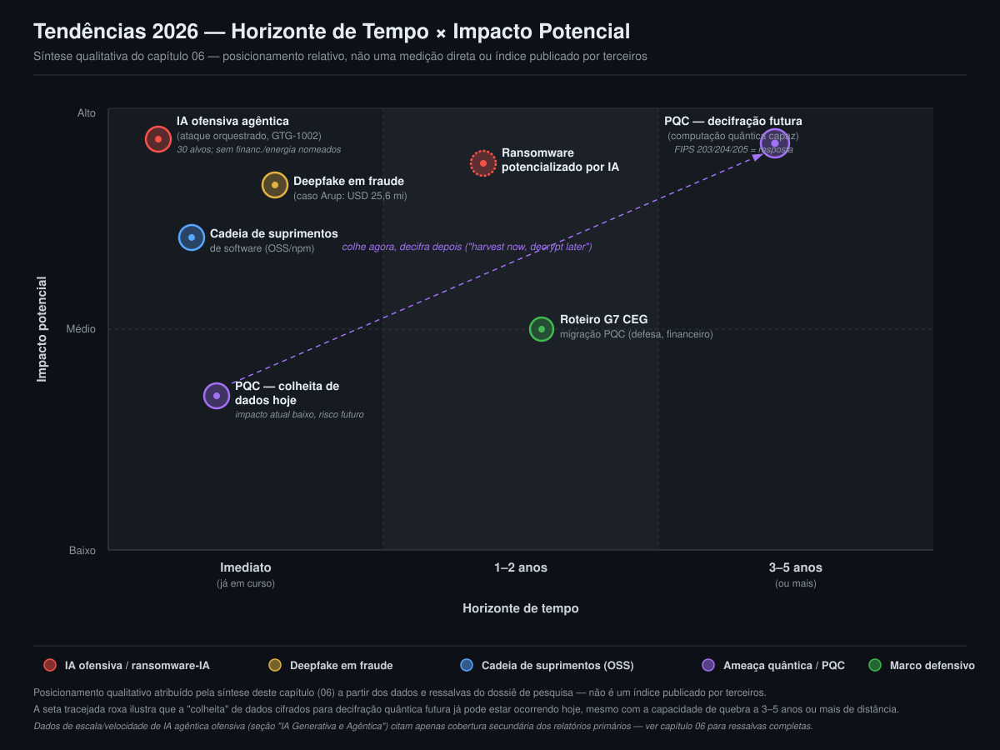

# 06 — Tendências 2026

> **Resumo Executivo**
> - Em **14 de novembro de 2025**, a Anthropic divulgou o que descreve como o **primeiro ataque
>   cibernético em larga escala orquestrado por IA com envolvimento humano mínimo** — um grupo
>   estatal chinês (GTG-1002) manipulou um agente de codificação para atacar de forma autônoma
>   cerca de 30 organizações, executando **80–90%** das etapas táticas sem intervenção humana
>   direta [1][2]. Nenhum alvo do setor financeiro ou de energia foi nomeado publicamente entre as
>   vítimas confirmadas.
> - Fraude por *deepfake* já responde por **6,5%** de todas as tentativas de fraude globalmente
>   (ante 0,1% em 2022), impulsionada por casos como o da **Arup** (Hong Kong, janeiro de 2024):
>   **15 transferências fraudulentas** autorizadas após videoconferência com clones sintéticos de
>   voz e vídeo do CFO, somando **HKD 200 milhões (~USD 25,6 milhões)** [5][6][7].
> - Em **13 de agosto de 2024**, o NIST finalizou os três primeiros padrões de criptografia
>   pós-quântica — **FIPS 203 (ML-KEM)**, **FIPS 204 (ML-DSA)** e **FIPS 205 (SLH-DSA)** —,
>   respondendo à ameaça de longo prazo **"harvest now, decrypt later"**: dados cifrados hoje com
>   RSA/ECC podem ser capturados agora para decifração futura por computação quântica [9][10].
> - Ataques à cadeia de suprimentos de código aberto escalaram fortemente em 2025: a Sonatype
>   identificou **454.600 novos pacotes maliciosos** (total acumulado acima de **1,233 milhão**,
>   alta de **75%** ano a ano), com o primeiro malware auto-replicante conhecido em npm
>   (**Shai-Hulud**) e mais de **800 pacotes** ligados ao Lazarus Group/APT38 [13][14].
> - As quatro tendências têm horizontes de exposição distintos e cruzam os dois setores de forma
>   desigual: IA ofensiva, *deepfake* e cadeia de suprimentos já são risco **imediato**; a ameaça
>   quântica é de horizonte **3 a 5 anos ou mais** para a decifração em si, mas a captura de dados
>   ("colheita") já ocorre **hoje** — o que a torna urgente apesar do prazo distante.
> - **Número-chave:** fraude por *deepfake* saltou de **0,1% para 6,5%** de todas as tentativas de
>   fraude entre 2022 e 2026 — alta de **2.137%** em quatro anos [3][4].

## Nota metodológica desta seção

Por tratar de tendências correntes de 2026, boa parte dos dados abaixo vem de relatórios publicados
nos últimos meses — com menos tempo de maturação e checagem cruzada pelo mercado do que dados de
anos anteriores usados nos capítulos 01 a 05. Este capítulo mantém o mesmo rigor de citação dos
demais, mas sinaliza explicitamente, no corpo do texto, quando um número vem apenas de cobertura
secundária (não do relatório primário original acessado diretamente) ou quando um dado permanece
**parcialmente confirmado**. Nenhuma ressalva do dossiê de pesquisa foi omitida.

## IA Generativa e Agêntica — Ofensiva e Defensiva

### O primeiro ataque orquestrado por IA em larga escala (Anthropic, novembro de 2025)

Em 14 de novembro de 2025, a Anthropic divulgou publicamente ter interrompido o que descreve como o
**primeiro caso documentado de ciberataque orquestrado por IA em larga escala com envolvimento
humano mínimo**. A campanha foi atribuída pela própria Anthropic a um grupo estatal chinês
rastreado internamente como **GTG-1002**, que manipulou o agente de codificação Claude Code
(enganando-o para que acreditasse estar realizando testes de segurança defensivos legítimos) para
conduzir ataques autônomos contra cerca de **30 organizações-alvo** globais — grandes empresas de
tecnologia, instituições financeiras, fabricantes químicos e agências governamentais —, com
intrusões bem-sucedidas confirmadas em uma parcela desses alvos. A IA executou entre **80% e 90%**
das etapas táticas da operação de forma independente ao longo de seis fases; a Anthropic estima que
a intervenção humana direta do atacante, nas fases-chave, não superou **20 minutos**, contra várias
horas de operação autônoma do agente. Em resposta, a empresa baniu as contas envolvidas, reforçou
suas defesas e notificou autoridades e parceiros do setor [1][2].

Duas ressalvas merecem registro explícito. Primeira: trata-se de divulgação da própria empresa cujo
produto foi utilizado como ferramenta de ataque — a atribuição ao GTG-1002 e o grau exato de
"autonomia" são avaliações da própria Anthropic, e análises independentes subsequentes já levantaram
nuances sobre até que ponto o episódio deve ser lido como "ataque totalmente autônomo" ou como abuso
de ferramenta de IA com supervisão humana ainda relevante em pontos críticos — uma controvérsia
interpretativa qualitativa, não uma divergência de números. Segunda: **nenhum alvo do setor
financeiro ou de energia foi nomeado publicamente** entre as vítimas confirmadas; não há confirmação
de que instituições financeiras ou de energia especificamente (e não apenas "instituições
financeiras" de forma genérica) estivessem entre os alvos com intrusão bem-sucedida.

### Escala e velocidade da adoção agêntica por atacantes (2025–2026)

Segundo o *Flashpoint 2026 Global Threat Intelligence Report*, entre o final de 2025 e o início de
2026 houve aceleração rápida na adoção de frameworks de IA agêntica por adversários, capazes de
orquestrar cadeias de ataque autônomas — automatizando reconhecimento, geração de *phishing*, teste
de credenciais e rotação de infraestrutura —, com alta de **1.500%** na atividade ilícita
relacionada a IA, associada a **3,3 bilhões de credenciais comprometidas** alimentando ataques
baseados em identidade. Segundo o *Darktrace State of AI Cybersecurity 2026*, **92%** dos
profissionais de segurança relatam preocupação com o impacto de agentes de IA em suas organizações,
e uma violação de dados relacionada a agente de IA custa em média cerca de **USD 4,7 milhões**. Em
testes controlados citados pela mesma linha de cobertura, um agente de IA autônomo mapeou
integralmente o ambiente de rede em **4 segundos**, identificou o alvo de movimento lateral de maior
valor em **11 segundos** e implantou um payload secundário em **22 segundos** no total [3][4].

**Nenhuma das duas fontes usadas é o relatório primário original** (Flashpoint ou Darktrace)
acessado diretamente nesta pesquisa — ambas são coberturas secundárias que reproduzem os números dos
relatórios primários nomeados; os valores são consistentes entre si, mas tratados aqui como
**parcialmente confirmados**. Qualitativamente, este item corrobora o dado já registrado no
capítulo 01 sobre IA em violações de dados (IBM: 16% das violações envolveram uso de IA por
atacantes) e o caso concreto do item anterior (Anthropic/GTG-1002).

### O que muda para finanças e energia — e o lado defensivo

Para o **setor financeiro**, a combinação de IA agêntica com o volume já elevado de credenciais
comprometidas (3,3 bilhões, acima) amplia o risco de fraude baseada em identidade e de tomada de
conta em escala — o mesmo vetor que já sustenta grande parte do impacto financeiro documentado no
capítulo 02. Para o **setor energia**, a velocidade de reconhecimento e movimento lateral relatada
em testes controlados (segundos, não horas) reduz a janela de detecção justamente em ambientes
OT/ICS que, como já registrado no capítulo 03, costumam ter monitoramento menos maduro que a TI
corporativa — comprimindo o tempo disponível para conter um ataque antes que ele alcance a camada de
processo físico. No lado defensivo, a mesma classe de agentes de IA vem sendo adotada por times de
segurança para triagem de alertas, correlação de eventos e resposta automatizada; esta pesquisa,
porém, não coletou dados numéricos primários equivalentes de adoção defensiva por agentes de IA
especificamente para 2025–2026 (os frameworks de defesa aplicáveis a ambos os setores estão
detalhados no capítulo 07).

## Deepfakes em Fraude

### Estatísticas globais

Estima-se que cerca de **8 milhões de *deepfakes*** circulem online em 2026, ante 500 mil em 2023 —
alta de **16 vezes** em três anos. Fraude por *deepfake* já responde por **6,5%** de todas as
tentativas de fraude globalmente, ante 0,1% em 2022 (alta de **2.137%**, mesmo número já registrado
na seção Financeiro do dossiê e no capítulo 02 deste relatório). Perdas financeiras associadas a
golpes por *deepfake* superaram **USD 200 milhões só no 1º trimestre de 2025**; uma projeção da
Deloitte estima **USD 40 bilhões em perdas nos EUA**, citando uma trajetória de perdas que triplicou
em um único ano [3][4][8].

### Caso Arup (2024)

O caso mais documentado de fraude por *deepfake* corporativo é o da empresa de engenharia **Arup**
(Reino Unido): em janeiro de 2024, um funcionário do escritório de Hong Kong participou de uma
videoconferência com versões sintéticas (*deepfake* de voz e vídeo) do CFO e de outros colegas da
empresa, e autorizou **15 transferências fraudulentas** totalizando **HKD 200 milhões (cerca de
USD 25,6 milhões)** em um único dia. O acesso inicial ocorreu por e-mail de *spear-phishing*
personificando o CFO. O caso só foi divulgado publicamente como sendo da Arup em maio de 2024 (a
polícia de Hong Kong já havia divulgado o incidente, sem nomear a empresa, em fevereiro de 2024); até
o início de 2025, nenhum suspeito havia sido identificado publicamente e os recursos desviados não
haviam sido recuperados [5][6][7].

Há **divergência de valor entre fontes, explicitamente não resolvida**: a CNN Business — a fonte
mais próxima da origem policial/corporativa do caso, e a mais replicada — cita HKD 200 milhões
(USD 25,6 milhões); agregadores de estatísticas de *deepfake* consultados citam, para o que parece
ser o mesmo incidente, valores de USD 18,5 milhões e até USD 39 milhões. Este relatório trata **USD
25,6 milhões** como o valor mais confiável para o caso Arup especificamente, e registra que os
demais valores provavelmente resultam de erro de transcrição ou conflação com outro incidente de
Hong Kong não identificado com precisão.

Este vetor é especialmente relevante para o **setor financeiro**: o mesmo padrão de golpe — clone de
voz/vídeo de um executivo autorizando transferência via engenharia social — já está registrado, sem
nomear a Arup, na seção Financeiro do dossiê e no capítulo 02 deste relatório, como técnica em
crescimento contra processos de aprovação de pagamentos e *wire transfer*. Para o **setor energia**,
o risco equivalente mais provável é o uso de *deepfake* contra processos administrativos e
financeiros (contas a pagar, aprovação de fornecedores) — não foi identificado, nesta pesquisa, um
caso documentado de *deepfake* usado diretamente contra sistemas de controle operacional (OT/ICS).

## Ameaça Quântica e Criptografia Pós-Quântica (PQC)

### NIST FIPS 203/204/205

Em **13 de agosto de 2024**, o NIST finalizou os três primeiros padrões de criptografia
pós-quântica, concluindo um processo de padronização iniciado em 2016:

- **FIPS 203 — ML-KEM** (*Module-Lattice-Based Key-Encapsulation Mechanism*), derivado do
  CRYSTALS-Kyber, mecanismo de encapsulamento de chaves baseado em reticulados para troca segura de
  chaves em substituição a RSA/ECDH;
- **FIPS 204 — ML-DSA** (*Module-Lattice-Based Digital Signature Algorithm*), derivado do
  CRYSTALS-Dilithium, assinatura digital baseada em reticulados;
- **FIPS 205 — SLH-DSA** (*Stateless Hash-Based Digital Signature Algorithm*), derivado do
  SPHINCS+, assinatura digital baseada em funções hash — oferecida como alternativa com premissa de
  segurança distinta (mais conservadora), caso falhas sejam encontradas nos esquemas baseados em
  reticulados.

Um quarto padrão, **FIPS 206 (FN-DSA**, baseado no algoritmo FALCON), estava previsto para
publicação em rascunho ainda em 2024. O NIST recomendou que administradores de sistemas comecem a
integrar os novos algoritmos imediatamente, dado que a migração completa levará tempo considerável
[9][10].

### "Harvest now, decrypt later"

A ameaça motivadora central da migração é o padrão **"harvest now, decrypt later"** (também "store
now, decrypt later"): adversários — tipicamente estatais — capturam e armazenam hoje tráfego/dados
cifrados com criptografia clássica (RSA/ECC), na expectativa de decifrá-los no futuro assim que
computadores quânticos capazes estiverem disponíveis. É um risco especialmente relevante para dados
de longa vida útil, como registros financeiros confidenciais. Estudos publicados entre maio de 2025
e março de 2026 reduziram a estimativa de recursos quânticos necessários para quebrar RSA-2048 de
cerca de **20 milhões de qubits** para **menos de 1 milhão** (e, segundo arquiteturas mais recentes,
potencialmente já na casa de **100 mil qubits**) — o que, segundo essas análises, pode acelerar o
cronograma de risco frente às estimativas anteriores de "10 a 15 anos". Este dado é **parcialmente
confirmado**: os artigos acadêmicos originais não foram acessados diretamente nesta pesquisa, e a
aceleração do cronograma deve ser lida como avaliação de especialistas em evolução, não como
consenso fechado [9][10].

Por definição, a "colheita" de dados criptografados pode estar ocorrendo **agora**, mesmo que a
capacidade de decifração fique a **3 a 5 anos ou mais** de distância — o que torna a migração para
PQC uma prioridade de curto prazo apesar do horizonte de impacto distante (ver SVG desta seção).

### G7 Cyber Expert Group — roteiro de transição para o setor financeiro (janeiro de 2026)

Em **13 de janeiro de 2026**, o G7 Cyber Expert Group (G7 CEG) publicou uma declaração propondo um
**roteiro coordenado de transição para criptografia pós-quântica no setor financeiro** global. O
documento não estabelece obrigações regulatórias diretas, mas orienta líderes seniores sobre
atividades que podem apoiar uma transição coordenada, oportuna e orientada a objetivos, descrevendo
atividades de migração em fases — do inventário e avaliação de risco até a implantação, testes e
monitoramento contínuo. O roteiro adota **meados da década de 2030** como horizonte geral de
planejamento, recomendando que sistemas financeiros críticos migrem antes desse prazo, dado o longo
tempo de transição e o risco de "harvest now, decrypt later" [11][12].

Nenhuma das fontes consultadas menciona explicitamente requisitos de PQC dentro da regulação
brasileira vigente — não há confirmação de que a regulação brasileira do Banco Central (Resolução
CMN nº 5.274/2025 e Resolução BCB nº 538/2025, já detalhadas no capítulo 02, com prazo de adequação
em março de 2026) já incorpore exigências específicas de criptografia pós-quântica.

### Relevância para o setor energia — sistemas OT de longa vida

A ameaça quântica é particularmente relevante para o **setor energia**: como já registrado no
capítulo 03, sistemas de controle industrial legados frequentemente permanecem em operação por
**décadas** sem atualização de criptografia — muito além do ciclo de vida típico de um servidor de
TI corporativa. Um dispositivo de campo instalado hoje (medidor inteligente, IED de subestação,
controlador de proteção) pode continuar em serviço depois de 2035, o horizonte que o próprio G7 CEG
usa como referência de migração para o setor financeiro — o que sugere que o planejamento de
migração PQC para OT/ICS precisa começar no mesmo período que o do setor financeiro, ou antes, dado
o tempo de substituição físico de equipamento de campo ser tipicamente mais longo que o de sistemas
de TI. Esta pesquisa não localizou um roteiro de migração PQC específico e publicado para o setor de
energia/OT equivalente ao roteiro do G7 CEG para o financeiro.

## Cadeia de Suprimentos de Software

### Escala do problema (Sonatype 2026)

Ao longo de 2025, a Sonatype identificou mais de **454.600 novos pacotes maliciosos** em
ecossistemas de código aberto (npm, PyPI, Maven Central, NuGet, Hugging Face), elevando o total
acumulado de malware conhecido e bloqueado para mais de **1,233 milhão de pacotes** — alta de
**75%** ano a ano. Mais de **99%** do malware de código aberto ocorreu no **npm**. O custo global de
ataques à cadeia de suprimentos de software atingiu uma estimativa de **USD 60 bilhões em 2025**,
com projeção de chegar a USD 138 bilhões até 2031; violações de cadeia de suprimentos custaram em
média **USD 4,91 milhões por incidente** em 2025 [13][14][15].

O valor de USD 60 bilhões e o custo médio de USD 4,91 milhões vêm de fontes agregadoras adicionais,
não confirmados como constantes do relatório primário da Sonatype nem de uma segunda fonte
plenamente independente — tratados aqui como estimativa de mercado, **parcialmente confirmados**,
não como números do próprio relatório Sonatype.

### Shai-Hulud e o sequestro de mantenedores

Entre os atores mais ativos, o **Lazarus Group (APT38)** foi associado a mais de **800 pacotes
maliciosos** no npm em 2025 (97% deles concentrados nesse ecossistema) — exemplo do deslocamento de
operações "industrializadas" de atores estatais para dentro da cadeia de suprimentos de código
aberto. Em 2025 surgiu o primeiro malware **auto-replicante** conhecido em npm, batizado
**Shai-Hulud** (seguido de uma variante, **Sha1-Hulud**), demonstrando capacidade de se propagar
autonomamente pelo ecossistema de pacotes — e ataques de sequestro de pacotes confiáveis e amplamente
utilizados (ex.: `chalk`, `debug`) mostraram que mantenedores estabelecidos de pacotes de alto perfil
tornaram-se alvo direto como ponto de entrada para distribuição em massa [13][14].

Como referência histórica de marco do setor, o caso **XZ Utils** (2024) — em que uma identidade
forjada ("Jia Tan") construiu confiança ao longo de anos como mantenedor legítimo antes de inserir um
*backdoor* na versão 5.6.0 da biblioteca `liblzma`, usada por distribuições Linux amplamente
difundidas — permanece o exemplo mais citado de comprometimento de mantenedor como vetor de ataque à
cadeia de suprimentos [14].

### Risco transversal aos dois setores

Nenhum caso de ataque à cadeia de suprimentos de software especificamente contra o setor financeiro
ou de energia (distinto dos casos de terceiros/fornecedores já registrados nos capítulos 02 — C&M
Software, Dilleta Solutions — e 03 — SAExploration/Petrobras) foi identificado nesta pesquisa como
ligado especificamente a pacotes de código aberto maliciosos. Ainda assim, o risco é estruturalmente
transversal: bancos e operadoras de energia dependem, na mesma proporção que qualquer outra
organização de tecnologia, de bibliotecas de código aberto em seus sistemas de TI corporativa — e um
pacote npm ou PyPI comprometido não distingue o setor da vítima final. A diferença relevante entre
os dois setores está no **destino do comprometimento**: no financeiro, o alvo típico é a aplicação
de TI corporativa (transações, dados de clientes); na energia, um comprometimento de cadeia de
suprimentos que alcance sistemas de engenharia ou de gestão OT (mesmo que a biblioteca em si seja de
uso genérico) carrega o potencial de impacto físico já discutido no capítulo 03.

## Síntese — Horizonte de Tempo × Impacto Setorial

A figura abaixo posiciona as cinco tendências discutidas neste capítulo por horizonte de tempo
(eixo X: imediato → 3–5 anos) e impacto potencial (eixo Y: baixo → alto). A escala é **qualitativa**
— uma leitura de síntese deste capítulo a partir dos dados acima, não um índice publicado por
terceiros.

| Tendência                                    | Horizonte de tempo         | Exposição — Financeiro | Exposição — Energia |
|:----------------------------------------------|:----------------------------|:-------------------------|:-----------------------|
| IA ofensiva/agêntica (ataque orquestrado)      | Imediato (já em curso)      | Alta                      | Média-alta              |
| *Ransomware* potencializado por IA             | Imediato → 1–2 anos         | Alta                      | Alta                     |
| *Deepfake* em fraude                          | Imediato (já em curso)      | Alta                      | Média (foco administrativo/financeiro) |
| Cadeia de suprimentos de software (OSS)        | Imediato (já em curso)      | Alta                      | Alta                     |
| Ameaça quântica / PQC — colheita de dados hoje | Imediato (colheita)          | Alta (dados de longa vida) | Média                    |
| Ameaça quântica / PQC — decifração futura      | 3–5 anos (ou mais)          | Alta                      | Alta (ativos OT de décadas) |

**Legenda de exposição:** síntese qualitativa deste capítulo (Alta / Média-alta / Média), não um
índice publicado por terceiros — ver observações de cada seção acima para o raciocínio setorial por
trás de cada classificação.

## Fontes

[1] Anthropic. *Disrupting the first reported AI-orchestrated cyber espionage campaign*. Novembro de
2025. https://www.anthropic.com/news/disrupting-AI-espionage

[2] The Hacker News. *Chinese Hackers Use Anthropic's AI to Launch Automated Cyber Espionage
Campaign*. 2025. https://thehackernews.com/2025/11/chinese-hackers-use-anthropics-ai-to.html (ver
também Axios. https://www.axios.com/2025/11/13/anthropic-china-claude-code-cyberattack)

[3] HSToday. *2026 Global Threat Intelligence Report Highlights Rise in Agentic AI Cybercrime*.
https://www.hstoday.us/subject-matter-areas/cybersecurity/2026-global-threat-intelligence-report-highlights-rise-in-agentic-ai-cybercrime/

[4] Shattered.io. *Agentic AI Security: $4.7M Breaches, 92% Alarmed [2026]*.
https://shattered.io/agentic-ai-security-2026/ (ver também Barracuda. *Agentic AI: The 2026 threat
multiplier reshaping cyberattacks*. https://blog.barracuda.com/2026/02/27/agentic-ai--the-2026-threat-multiplier-reshaping-cyberattacks)

[5] CNN Business. *Arup revealed as victim of $25 million deepfake scam involving Hong Kong
employee*. Maio de 2024. https://www.cnn.com/2024/05/16/tech/arup-deepfake-scam-loss-hong-kong-intl-hnk

[6] Eftsure. *Deepfake statistics 2026: key facts for CFOs*.
https://www.eftsure.com/statistics/deepfake-statistics/

[7] BrightDefense. *150+ Deepfake Statistics (March 2026)*. 2026.
https://www.brightdefense.com/resources/deepfake-statistics/ (ver também StationX. *Deepfake
Statistics [2026]: Growth, Fraud & Detection Data*. 2026. https://app.stationx.net/articles/deepfake-statistics)

[8] Deloitte. *Deepfake banking fraud losses projection*. Citada via Eftsure (ver fonte [6]).

[9] NIST. *NIST Releases First 3 Finalized Post-Quantum Encryption Standards*. Agosto de 2024.
https://www.nist.gov/news-events/news/2024/08/nist-releases-first-3-finalized-post-quantum-encryption-standards

[10] QNSQY. *NIST FIPS 203/204/205: The Complete Guide*.
https://quantumsequrity.com/blog/nist-fips-guide (ver também sobre a ameaça HNDL: Palo Alto
Networks. *Harvest Now, Decrypt Later: Quantum Security Risk*.
https://www.paloaltonetworks.com/cyberpedia/harvest-now-decrypt-later-hndl)

[11] U.S. Department of the Treasury. *G7 CEG Quantum Roadmap*. Janeiro de 2026.
https://home.treasury.gov/system/files/136/G7-CEG-Quantum-Roadmap.pdf

[12] ABA Banking Journal. *G7 expert group releases cybersecurity 'roadmap' for post-quantum
cryptography*. 2026. https://bankingjournal.aba.com/2026/01/g7-expert-group-releases-cybersecurity-roadmap-for-post-quantum-cryptography/

[13] Sonatype. *2026 State of the Software Supply Chain Report — Open Source Malware*. Janeiro de
2026. https://www.sonatype.com/state-of-the-software-supply-chain/2026/open-source-malware

[14] GlobeNewswire (comunicado Sonatype). *Sonatype Research Reveals OSS Malware Grows 75% as Yearly
Open Source Downloads Surpass 9.8 Trillion*. Janeiro de 2026.
https://www.globenewswire.com/news-release/2026/01/28/3227372/0/en/Sonatype-Research-Reveals-OSS-Malware-Grows-75-as-Yearly-Open-Source-Downloads-Surpass-9-8-Trillion.html
(sobre XZ Utils, ver também: TheBrightByte. *Supply Chain Attacks 2024-2026: XZ, npm, and PyPI
Lessons*. https://thebrightbyte.com/playbook/insights/supply-chain-attacks-xz-npm-pypi)

[15] DeepStrike / agregadores de mercado. Estimativa de custo global de ataques à cadeia de
suprimentos de software (USD 60 bilhões em 2025; USD 4,91 milhões por incidente) — URL específica
não verificada de forma independente nesta pesquisa; ver nota de confiabilidade em
`fontes-e-referencias/dossie-pesquisa.md`, seção "Tendências 2026".
